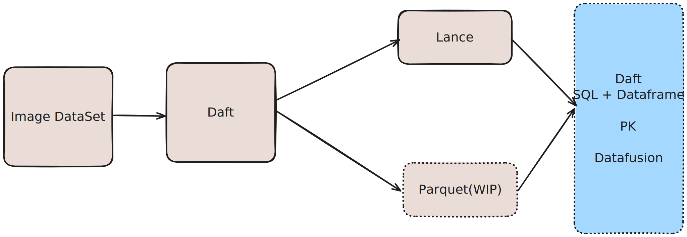

# Lance Benchmarking

## Objectives
1. Identify performance bottlenecks in Daft's Lance data source interface
2. Compare Daft with other frameworks when using Lance data source interfaces

## Environment Setup
Create virtual environment and install dependencies:
```bash
python -m venv venv
source venv/bin/activate
pip install -r benchmark-requirements.txt

# Install official release
pip install daft
```

## Benchmark Framework
This repository contains batch inference benchmarks using:
- Daft
- DuckDB
- Datafusion

Using MLPerf Inference Benchmark Suite (Offline Scenario) for image classification:

- Dataset: [ImageNet 2012](https://image-net.org/challenges/LSVRC/2012/2012-downloads.php#Images)

Workflow consists of 3 steps:


Key Comparison Dimensions:
1. Read performance between Daft vs Datafusion vs DuckDB on Lance tables
2. Aggregation performance comparison
3. Filter performance comparison
4. Sorting performance comparison

## Data Preparation
1. Download data from specified links
2. Upload to S3 storage
3. Modify S3 path configuration in `benchmarking/lance/generate.py`
4. Run `generate.py` to create Lance tables

## Running Benchmarks
```bash
pytest -s test_query.py -v --benchmark-verbose
```

## Generate Flamegraph
```bash
py-spy record -o benchmark_flamegraph.svg -- pytest benchmarking/lance/test_query.py -k 'test_daft_dataframe_read_lance'
```