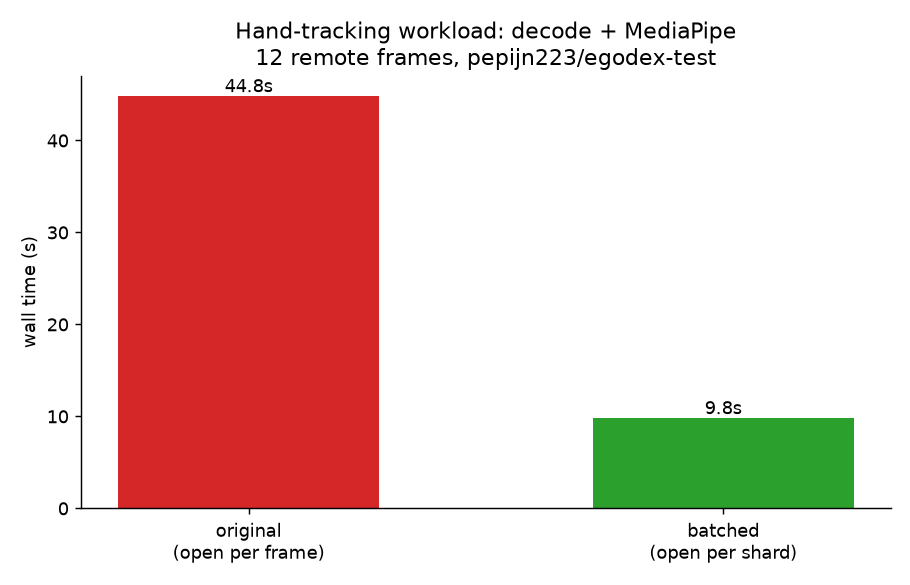

# LeRobot video decode: per-frame → per-shard

The `daft.datasets.lerobot` reader decoded video frames with a **per-row** UDF that
re-opened the MP4 shard for every frame. Because `av.open()` on a remote shard
re-reads and parses the container index over the network, decoding N frames
re-opened the shard N times, paying that cost each time - so cost scaled ~linearly
at **~3s/frame** (the slope of the sweep below).

This directory holds the benchmarks that diagnosed it and the fix that makes the
decode **batched**: rows sharing a shard within a batch are grouped so each shard is
opened once per batch, instead of once per frame.

## The fix: batched decode

`_decode_lerobot_video_timestamp` in [`daft/datasets/lerobot.py`](../../daft/datasets/lerobot.py) is now a
`@daft.func.batch` UDF. Within each batch it groups rows by shard path, opens each
shard once, and does a single forward decode assigning the closest frame to every
requested timestamp. Output is **byte-identical** to the old per-row decode.

### Original vs batched (rows 1→10)

[`sweep.py`](sweep.py) times an end-to-end `lerobot.read(...).limit(n).collect()` with
frame decoding for n = 1..10 rows of a remote test dataset (`pepijn223/egodex-test`),
run once per reader revision (merge-base vs this branch) - the original grows linearly
to ~34s; the batched version stays flat at ~4s (all 10 frames share one shard → one
open). All benchmarks in this directory were run on the same machine, an Apple
M4 Max (36 GB).


| rows | original | batched |
| --- | --- | --- |
| 1 | 4.2s | 4.4s |
| 8 | **25.0s** | **3.9s** |
| 10 | 34.4s | 3.9s |

8-frame output hashes matched exactly (`sha 80bdb30c…`) between versions.

Beyond this test dataset, the fix was validated on six public LeRobot v3 datasets
spanning av1/h264/mp4v, 5-30 fps, 128x128-1280x720, and 1-3 cameras - pixel-identical
output everywhere, 4-13x faster - plus a full-dataset decode and a 100-frame
comparison. See [real_datasets.md](real_datasets.md).


### Downstream workload: hand tracking

[`hand_tracking.py`](hand_tracking.py) times the
[daft-physical-ai demo](https://github.com/Eventual-Inc/daft-physical-ai/blob/main/examples/demo.py)
workload end to end: decode 12 remote frames of `pepijn223/egodex-test` and run
MediaPipe hand tracking as a Daft UDF. [`run_hand_tracking.sh`](run_hand_tracking.sh)
runs it once per reader revision (the original pinned to the parent of the #7184
merge commit) and checks the detected hands match. Measured 2026-07-14 on an
Apple M4 Max (36 GB, macOS 15.6), remote reads over `hf://`:
**44.8s → 9.8s**, identical detections.



## Running

```bash
python sweep.py --label batched      # rows 1..10 sweep + chart
./run_hand_tracking.sh               # hand-tracking workload A/B + chart
```
