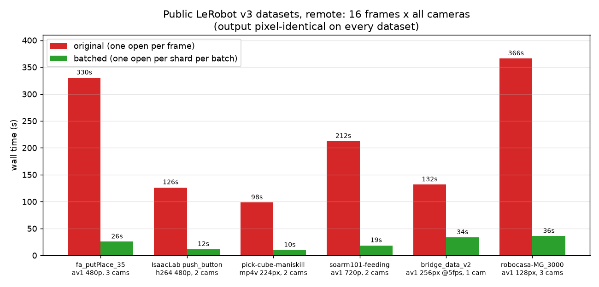

# LeRobot video decode: per-frame → per-shard

The `daft.datasets.lerobot` reader decoded video frames with a **per-row** UDF that
re-opened the MP4 shard for every frame. Because `av.open()` on a remote shard
re-reads and parses the container index over the network, decoding N frames
re-opened the shard N times, paying that cost each time - so cost scaled ~linearly
at **~3s/frame** (the slope of the sweep below).

This directory holds the benchmarks that diagnosed it and the fix that makes the
decode **batched**: rows sharing a shard within a batch are grouped so each shard is
opened once per batch, instead of once per frame.

## The fix: batched decode

`_decode_lerobot_video_timestamp` in [`daft/datasets/lerobot.py`](../../daft/datasets/lerobot.py) is now a
`@daft.func.batch` UDF. Within each batch it groups rows by shard path, opens each
shard once, and does a single forward decode assigning the closest frame to every
requested timestamp. Output is **byte-identical** to the old per-row decode.

### Original vs batched (rows 1→10)

[`sweep.py`](sweep.py) times an end-to-end `lerobot.read(...).limit(n).collect()` with
frame decoding for n = 1..10 rows of a remote test dataset (`pepijn223/egodex-test`),
run once per reader revision (merge-base vs this branch) - the original grows linearly
to ~34s; the batched version stays flat at ~4s (all 10 frames share one shard → one
open).


| rows | original | batched |
| --- | --- | --- |
| 1 | 4.2s | 4.4s |
| 8 | **25.0s** | **3.9s** |
| 10 | 34.4s | 3.9s |

8-frame output hashes matched exactly (`sha 80bdb30c…`) between versions.

Beyond this test dataset, the fix was validated on six public LeRobot v3 datasets
spanning av1/h264/mp4v, 5-30 fps, 128x128-1280x720, and 1-3 cameras - pixel-identical
output everywhere, 4-13x faster - plus a full-dataset decode and a 100-frame
comparison. See [real_datasets.md](real_datasets.md).



## Multiprocess

Running the decode under `use_process=True` produces byte-identical output. File
handles are not shared across processes, so partition by shard - each shard is then
opened by one worker instead of re-fetched by several. That caps parallelism at one
worker per file, which is fine in practice: LeRobot v3 bounds shard size
(`video_files_size_in_mb`, 200MB default), so a dataset is many files.

[`worker_scaling.py`](worker_scaling.py) repeats the frames sweep at 1/2/4/8 worker
processes (8 shards, dense consecutive frames, the two strategies as standalone UDFs):


More workers shift the original down with diminishing returns; batched on one worker
(2.2s) still beats the original on eight (6.0s).

## Tradeoffs

The batched decode does one forward pass from the earliest to the latest timestamp
in a batch, so its cost depends on how spread out those timestamps are:

- **Dense consecutive frames (the common case - reading full episodes):** optimal.
  One open, one pass, no redundant decoding - the charts above.
- **Sparse timestamps in a batch:** the pass decodes through small gaps too (gaps
  over ~10s are seeked over instead), but on a remote shard one fewer open is worth
  more than the extra decoding ([`sparse.py`](sparse.py), frames spread across the
  whole shard):

  

  | frames | original | batched |
  | --- | --- | --- |
  | 2 | 2.1s | 2.1s |
  | 8 | 7.7s | 1.7s |
  | 16 | 15.5s | 1.8s |

  Batched stays flat (one open) while original grows one open per frame.

- **Row order:** the win assumes a shard's rows land in the same batch. The reader
  emits rows sorted by `(episode_index, frame_index)`, so they do - opens stay at one
  per shard as the dataset grows ([`ordering.py`](ordering.py)). Shuffled rows cost
  more opens, but still stay below the original's one-per-frame.

  

## Running

```bash
python sweep.py --label batched      # rows 1..10 sweep + chart
python worker_scaling.py             # original vs batched by worker count (downloads ~7MB shard)
python sparse.py                     # sparse-frames worst case, remote
python ordering.py                   # opens vs dataset size: ordered vs shuffled rows
```
