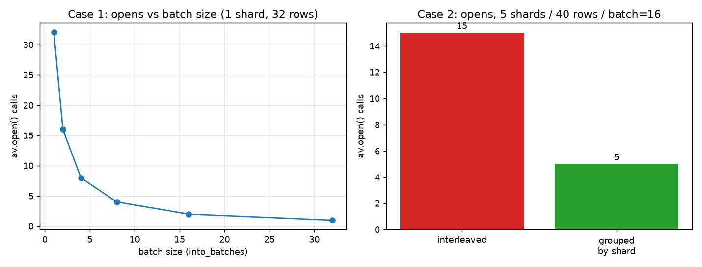

# LeRobot video decode: per-frame → per-shard

The `daft.datasets.lerobot` reader decoded video frames with a **per-row** UDF that
re-opened the MP4 shard for every frame. Because `av.open()` on a remote shard
fetches the container index over the network, decoding N frames re-fetched the
shard N times - cost scaled ~linearly at **~3s/frame**.

This directory holds the benchmarks that diagnosed it and the fix that makes the
decode **batched**: rows sharing a shard are grouped so the shard is opened (and
fetched) once per batch.

## Where the time went (it is not parsing or decoding)

Raw PyAV on the shard, no Daft (`raw_av.py`):

| approach | 8 frames |
| --- | --- |
| open once + decode 8 (remote URL) | **0.9s** |
| open per frame ×8 (remote URL) | **8.1s** |
| open once + decode 8 (local file) | **0.07s** |

Opening + parsing + decoding are cheap. The cost is the **per-frame network fetch**
at `av.open()`. Opening once is ~9× faster remote, ~100× on a local file.

## The fix: batched decode

`_decode_lerobot_video_timestamp` in `daft/datasets/lerobot.py` is now a
`@daft.func.batch` UDF. Within each batch it groups rows by shard path, opens each
shard once, and does a single forward decode assigning the closest frame to every
requested timestamp. Output is **byte-identical** to the old per-row decode.

### Original vs batched (rows 1→10)

`sweep.py` - the original grows linearly to ~34s; the batched version stays flat at
~4s (all 10 frames share one shard → one open).


| rows | original | batched |
| --- | --- | --- |
| 1 | 4.2s | 4.4s |
| 8 | **25.0s** | **3.9s** (~6.5×) |
| 10 | 34.4s | 3.9s |

8-frame output hashes matched exactly (`sha 80bdb30c…`) between versions.

## Scaling behavior (`cases.py`)

`av.open()` calls counted while running the real batch UDF over local shard copies.



- **Batch size (1 shard, 32 rows):** opens = `ceil(rows / batch_size)`. `batch=1`
  degenerates to the old per-frame behavior (32 opens); `batch=32` → 1 open.
- **Multi-shard (5 shards, 40 rows, batch=16):** opens = distinct shards present in
  each batch. Interleaved row order → **15 opens**; sorted by shard → **5 opens**,
  identical output. So partitioning/sorting by shard is the lever that minimizes
  opens (and, when distributed, downloads-per-worker).

## Multiprocess

Running the decode under `use_process=True` produces byte-identical output, so the
batched decode survives process serialization. Each worker/process opens the shards
in its own batches once (file handles are not shared across processes); partition by
shard to make that one download per shard per worker.

## Running

```bash
python raw_av.py --remote            # isolate open vs decode cost
python repro.py --rows 8             # time a decode (optionally --profile)
python sweep.py --label batched      # rows 1..10 sweep + chart
python cases.py                      # batch-size + multi-shard opens (downloads ~7MB shard)
```
