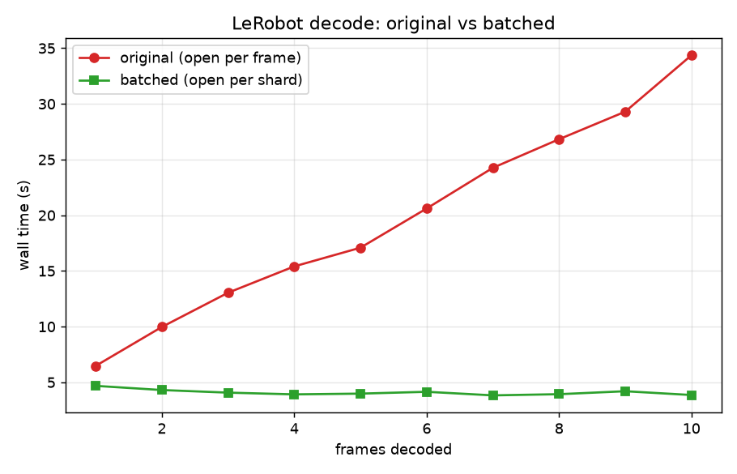
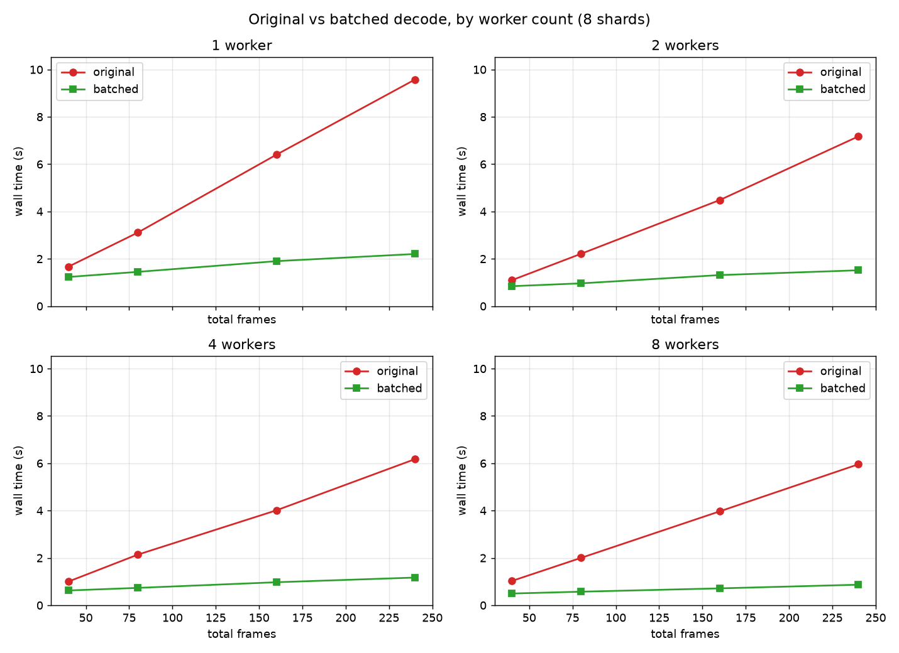
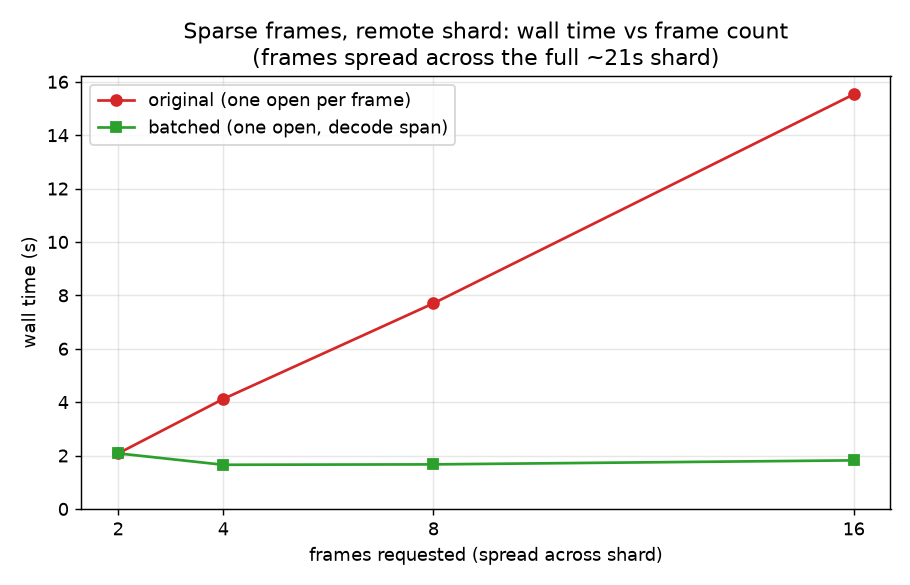
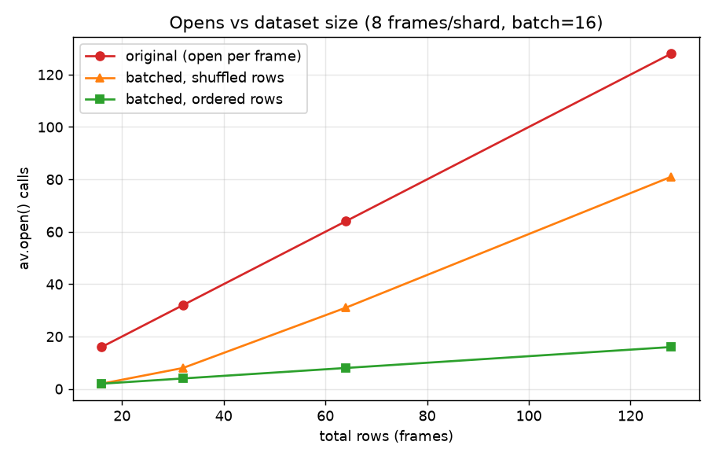

# LeRobot video decode: per-frame → per-shard

The `daft.datasets.lerobot` reader decoded video frames with a **per-row** UDF that
re-opened the MP4 shard for every frame. Because `av.open()` on a remote shard
re-reads and parses the container index over the network, decoding N frames
re-opened the shard N times, paying that cost each time - so cost scaled ~linearly
at **~3s/frame** (the slope of the sweep below).

This directory holds the benchmarks that diagnosed it and the fix that makes the
decode **batched**: rows sharing a shard within a batch are grouped so each shard is
opened once per batch, instead of once per frame.

## Where the time went

`python repro.py --rows 1 --profile` - cProfile self-time (`tottime`) for a single
frame, which is dominated by opening the shard, not decoding it:

| function | self-time |
| --- | --- |
| `av.container.core.open` (open + fetch shard index) | ~3.3s |
| decode loop (`_decode_lerobot_video_timestamp`) | ~1.3s |
| file read (`_from_file_reference`) | ~0.9s |

`av.open()` on the remote shard is the bottleneck, and the per-row UDF paid it for
every frame.

## The fix: batched decode

`_decode_lerobot_video_timestamp` in [`daft/datasets/lerobot.py`](../../daft/datasets/lerobot.py) is now a
`@daft.func.batch` UDF. Within each batch it groups rows by shard path, opens each
shard once, and does a single forward decode assigning the closest frame to every
requested timestamp. Output is **byte-identical** to the old per-row decode.

### Original vs batched (rows 1→10)

[`sweep.py`](sweep.py) - the original grows linearly to ~34s; the batched version stays flat at
~4s (all 10 frames share one shard → one open).



| rows | original | batched |
| --- | --- | --- |
| 1 | 4.2s | 4.4s |
| 8 | **25.0s** | **3.9s** |
| 10 | 34.4s | 3.9s |

8-frame output hashes matched exactly (`sha 80bdb30c…`) between versions.

## Multiprocess

Running the decode under `use_process=True` produces byte-identical output, so the
batched decode survives process serialization. Each worker/process opens the shards
in its own batches (file handles are not shared across processes); partition by shard
so each shard is handled by a single worker, rather than re-fetched across several.

That single-worker-per-shard mapping caps parallelism at one worker per file, but in
practice LeRobot v3 bounds shard size (`video_files_size_in_mb`, e.g. 200MB) so a
dataset is many files - plenty to spread across workers. It is only a bottleneck if
that setting is raised to produce a few very large files.

How does the change hold up as the number of workers grows? [`worker_scaling.py`](worker_scaling.py)
reproduces the original-vs-batched frames sweep at 1/2/4/8 worker processes (8
shards, dense consecutive frames, scalar return to isolate decode compute):



At each worker count the original grows steeply with frame count while batched stays
low. Adding workers shifts the original down but with diminishing returns (it settles
around 6s at 240 frames from 4 workers on), because it re-opens and re-decodes from
the keyframe for every frame - parallelism spreads that redundant work rather than
removing it. At 240 frames, batched on one worker (2.2s) is still faster than the
original on eight (6.0s). Local copies, so this is decode-compute; parallel network
fetch of distinct shards is an extra real-cluster win not shown here.

## Tradeoffs

The batched decode does one forward pass from the earliest to the latest timestamp
in a batch, so its cost depends on how spread out those timestamps are:

- **Dense consecutive frames (the common case - reading full episodes):** optimal.
  One open, one pass, no redundant decoding - the charts above.
- **Sparse timestamps in a batch:** the pass decodes the gaps too (e.g. 5 frames
  spread across a 20s shard decodes ~600 frames vs ~20 for a per-target seek). It
  still wins remotely, because one saved download is worth more than the extra
  decoding. Remote, frames spread across the whole shard ([`sparse.py`](sparse.py)):

  

  | frames | original | batched |
  | --- | --- | --- |
  | 2 | 2.1s | 2.1s |
  | 8 | 7.7s | 1.7s |
  | 16 | 15.5s | 1.8s |

  Batched stays flat (one open) while original grows one download per frame. It only
  loses to a per-target seek when there is no network *and* the timestamps are sparse.

- **Row order (holds as data scales):** grouping happens per batch, so the win assumes
  a shard's rows land in the same batch. The reader emits rows sorted by
  `(episode_index, frame_index)`, so they do - opens stay at one per shard as the
  dataset grows ([`ordering.py`](ordering.py)). Shuffled rows scatter a shard across batches and cost
  more opens, but still stay below the original's one-per-frame. Correctness is
  order-independent (timestamps are sorted within each batch).

  

Memory is bounded regardless of shard size (only the best frame per row is kept, at
most one per batch row). A gap-based clustering pass (decode contiguous runs, re-seek
across large gaps, reuse the open) would be best-of-both for the local+sparse case,
but it is extra complexity for a narrow benefit and is left as a possible follow-up.

## Running

```bash
python repro.py --rows 8             # time a decode (add --profile for the breakdown above)
python sweep.py --label batched      # rows 1..10 sweep + chart
python worker_scaling.py             # original vs batched by worker count (downloads ~7MB shard)
python sparse.py                     # sparse-frames worst case, remote
python ordering.py                   # opens vs dataset size: ordered vs shuffled rows
```
