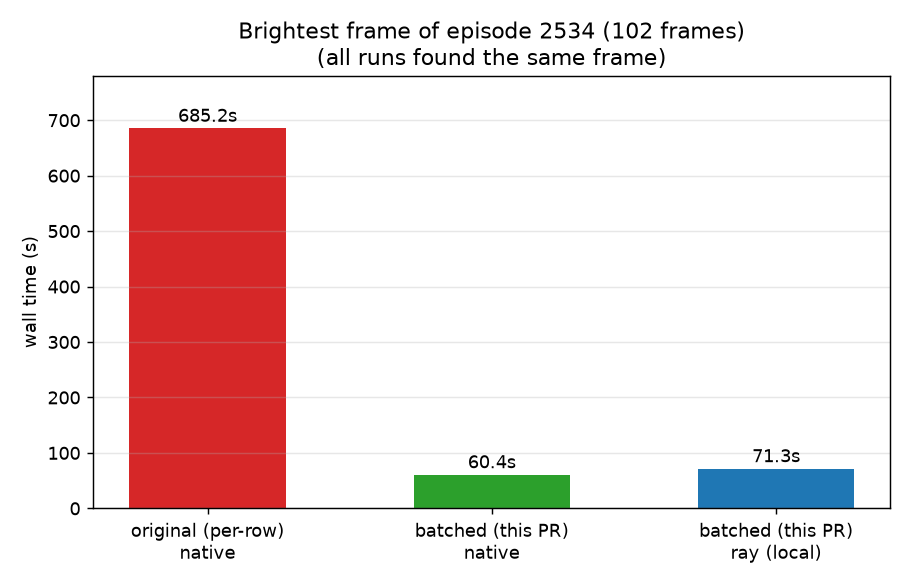

# Brightest frame: an end-to-end decode task

A small real-workload demo of the batched decode: find the brightest frame of
one episode's camera. Every frame of the episode is decoded, reduced to a
mean-luminance float by a second batch UDF, and the max is picked.

## Run

```bash
python brightest_frame.py [dataset] [episode] [camera]
```

## Result: BitRobot/HIW-500-LeRobot, episode 2534

Dataset: 23,743 episodes / 40.8M frames, 3 AV1 cameras (av1, yuv420p,
keyframe interval 2). Episode 2534 is ~100 frames (dataset median is 1,140).
Remote reads over `hf://`, single machine, native runner; measured 2026-07-06.



| reader | runner | frames | wall | per frame |
| --- | --- | --- | --- | --- |
| original (per-row) | native | 102 | 685.2s | 6.72s |
| batched (this PR) | native | 102 | 60.4s | 0.59s |
| batched (this PR) | ray (local) | 102 | 71.3s | 0.70s |

Camera: observation.images.head (1280x480). 11.3x faster than the original;
all three runs found the same brightest frame (`frame_index=74`, t=2.467s,
mean brightness 124.54).

The original-reader run used the merge-base `daft/datasets/lerobot.py` swapped
into a copy of the package on `PYTHONPATH` (the fix is Python-only), same
machine, runs not concurrent.

## Distributed runner observations (local ray, 14-core M-series, 36 GB)

The distributed concern raised in review was memory: could the batched decode
UDF receive oversized batches or accumulate decoded frames on the ray runner.
Measured behavior says no:

- Batch sizes observed by the UDF (`batch_len` probe): min 6, max 16 - the
  `into_batches(16)` bound holds on the ray runner; no oversized batches.
- One episode (1 shard): total RSS across all 19 ray processes climbed to
  ~2.9 GB and plateaued (includes ray's own baseline: GCS, raylet, idle
  workers). No runaway growth.
- Ten episodes decoded concurrently (10 shards): peak ~3.7 GB total - about
  +80 MB per additional in-flight shard over the single-shard plateau, linear
  and small. Observed twice: during ~4 minutes of sustained remote decode
  (run killed by HF throttling, below) and on a complete run against a local
  mirror of the same files. Batch bound held there too (min 1, max 16 across
  ~64 batches). Decoded frames are reduced to floats in-pipeline and never
  accumulate.
- The local-mirror run also separates decode cost from network: 1,001 frames
  in 12.1s (~83 fps aggregate on 14 cores) vs 0.59s/frame remote - the remote
  per-frame cost is ~98% network, not decode.

Extrapolating: a 64-core worker running 64 concurrent decode tasks would add
roughly 64 x ~80 MB = ~5 GB over baseline. Untested beyond a single machine:
multi-node object store behavior, and workloads that materialize the decoded
frames instead of reducing them.

| run (batched reader, ray runner) | frames | wall | per frame |
| --- | --- | --- | --- |
| 1 episode, remote hf:// | 102 | 71.3s | 0.70s |
| 10 episodes, local mirror | 1001 | 12.1s | 0.012s |

## Hugging Face throttling (found while running the above)

Reading shards directly from `hf://` at benchmark rates trips HF rate limits:
anonymous requests got 429-throttled ~30s into the 10-episode run; with an
access token (via `daft.io.HuggingFaceConfig(token=...)`) the same run
survived ~5 minutes of decoding before being throttled. The decode's access
pattern (shard re-open per 16-row batch x concurrent shards, plus per-cluster
range reads) is request-heavy by design.

Consequences:

- A single 429 currently kills the whole query - the decode UDF sets no
  `max_retries`, so transient IO errors are fatal.
- Any cluster-scale run against `hf://` will hit this immediately; mirror the
  dataset to object storage (S3 etc.) first. The complete 10-episode run above
  used a local mirror for this reason (10 shards + metadata via
  `huggingface_hub.snapshot_download`).
- Passing the token via `HTTPConfig(bearer_token=...)` hangs hf:// reads
  entirely - see [hf_bearer_token_hang.md](hf_bearer_token_hang.md).

The per-frame rate on a short episode is dominated by fixed overhead
(metadata reads, shard opens); longer episodes amortize it.
