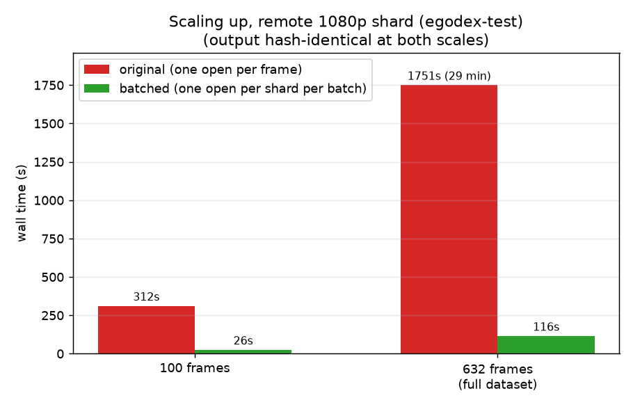

# Validation on public datasets

The batched decode was validated against the original per-row decode on public
LeRobot v3 datasets from Hugging Face, chosen from a survey of LeRobot-tagged
datasets to cover the codec, fps, resolution, and camera-count diversity found
in the wild. Measured 2026-07-01, remote reads over `hf://`, single machine.
Re-measured 2026-07-03 on the PR's final revision: pixel-identical again on all
six datasets, comparable timings (original-side wall times vary with network).

## Method

[`real_datasets.py`](real_datasets.py) decodes the first 16 frames of episode 0
(every camera column) with whichever reader is installed, in a fresh process,
and writes per-frame SHA-256 hashes (raw RGB pixels) plus wall time for the
full `lerobot.read(..., load_video_frames=True)` pipeline. It is run once per
reader revision - `daft/datasets/lerobot.py` at the PR's merge-base ("original")
vs this branch ("batched"); the fix is Python-only, so the underlying build is
identical - and the two outputs are compared hash-for-hash with `--compare`.

## Results: 16 frames, all cameras

| dataset | codec | resolution | fps | cams | original | batched | output |
| --- | --- | --- | --- | --- | --- | --- | --- |
| AlexFeng1/fa_putPlace_35 | av1 | 640x480 | 30 | 3 | 330s | 25.5s | identical |
| Cache-SCA/IsaacLab-SO101-...-push_button | h264 | 640x480 | 10 | 2 | 126s | 11.5s | identical |
| Helloworldali/pick-cube-maniskill | mp4v | 224x224 | 30 | 2 | 98s | 10.0s | identical |
| HCIS-Lab/soarm101-feeding-nuts | av1 | 1280x720 | 30 | 2 | 213s | 18.6s | identical |
| Jackie1/bridge_data_v2_convert | av1 | 256x256 | 5 | 1 | 132s | 33.5s | identical |
| DAVIAN-Robotics/robocasa-MG_3000 | av1 | 128x128 | 20 | 3 | 366s | 35.9s | identical |

Every frame pixel-identical across all six datasets; 4-13x faster. The 5 fps
dataset exercises the tolerance logic at its loosest (tolerance is half a frame
period, so 0.1s there vs 0.017s at 30 fps). Multi-camera datasets hit the
per-frame cost hardest with the original reader, since every camera multiplies
the per-frame opens.

## Results: scaling up (pepijn223/egodex-test, av1 1920x1080 @30)

| run | frames | wall | per frame |
| --- | --- | --- | --- |
| original | 100 | 311.8s | 3.12s |
| batched | 100 | 25.6s | 0.26s |
| original | 632 (full dataset) | 1750.7s | 2.77s |
| batched | 632 (full dataset) | 115.8s | 0.18s |

- Outputs are hash-identical between readers at both scales - including every
  single frame of the full 632-frame dataset.
- At scale the batched cost grows with the number of batches rather than
  frames (each 16-row batch opens its shard once), so it is linear with a much
  smaller slope - ~0.2s/frame here vs ~3s/frame for the original. Reading the
  full dataset drops from 29 minutes to under 2.
