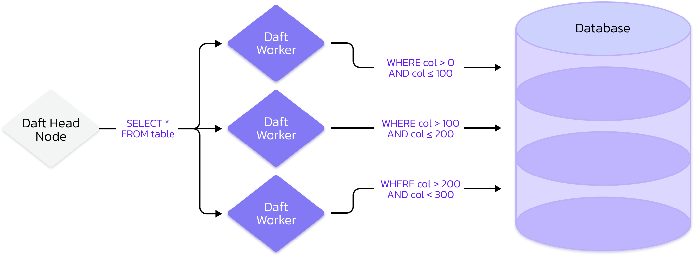

# SQL

You can read the results of SQL queries from databases, data warehouses, and query engines, into a Daft DataFrame via the [`daft.read_sql()`](https://www.getdaft.io/projects/docs/en/stable/api_docs/doc_gen/io_functions/daft.read_sql.html#daft.read_sql) function.

Daft currently supports:

1. **20+ SQL Dialects:** Daft supports over 20 databases, data warehouses, and query engines by using [SQLGlot](https://sqlglot.com/sqlglot.html) to convert SQL queries across dialects. See the full list of supported dialects [here](https://sqlglot.com/sqlglot/dialects.html).

<<<<<<< HEAD
2. **Parallel + Distributed Reads:** Daft parallelizes SQL reads by using all local machine cores with its default multithreading runner, or all cores across multiple machines if using the [distributed Ray runner](../distributed.md).
=======
2. **Parallel + Distributed Reads:** Daft parallelizes SQL reads by using all local machine cores with its default multithreading runner, or all cores across multiple machines if using the [distributed Ray runner](../advanced/distributed.md).
>>>>>>> bb85070a9c582695946b03f30adde6480c58db56

3. **Skipping Filtered Data:** Daft ensures that only data that matches your [`df.select(...)`](https://www.getdaft.io/projects/docs/en/stable/api_docs/doc_gen/dataframe_methods/daft.DataFrame.select.html#daft.DataFrame.select), [`df.limit(...)`](https://www.getdaft.io/projects/docs/en/stable/api_docs/doc_gen/dataframe_methods/daft.DataFrame.limit.html#daft.DataFrame.limit), and [`df.where(...)`](https://www.getdaft.io/projects/docs/en/stable/api_docs/doc_gen/dataframe_methods/daft.DataFrame.where.html#daft.DataFrame.where) expressions will be read, often skipping entire partitions/columns.

## Installing Daft with SQL Support

Install Daft with the `getdaft[sql]` extra, or manually install the required packages: [ConnectorX](https://sfu-db.github.io/connector-x/databases.html), [SQLAlchemy](https://docs.sqlalchemy.org/en/20/orm/quickstart.html) and [SQLGlot](https://sqlglot.com/sqlglot.html).

```bash
pip install -U "getdaft[sql]"
```

## Reading a SQL query

To read a SQL query, provide [`daft.read_sql()`](https://www.getdaft.io/projects/docs/en/stable/api_docs/doc_gen/io_functions/daft.read_sql.html#daft.read_sql) with the **SQL query** and a **URL** for the data source.

The example below creates a local SQLite table for Daft to read.

=== "🐍 Python"

    ```python
    import sqlite3

    connection = sqlite3.connect("example.db")
    connection.execute(
        "CREATE TABLE IF NOT EXISTS books (title TEXT, author TEXT, year INTEGER)"
    )
    connection.execute(
        """
    INSERT INTO books (title, author, year)
    VALUES
        ('The Great Gatsby', 'F. Scott Fitzgerald', 1925),
        ('To Kill a Mockingbird', 'Harper Lee', 1960),
        ('1984', 'George Orwell', 1949),
        ('The Catcher in the Rye', 'J.D. Salinger', 1951)
    """
    )
    connection.commit()
    connection.close()
    ```

After writing this local example table, we can easily read it into a Daft DataFrame.

=== "🐍 Python"

    ```python
    # Read SQL query into Daft DataFrame
    import daft

    df = daft.read_sql(
        "SELECT * FROM books",
        "sqlite://example.db",
    )
    ```

Daft uses [ConnectorX](https://sfu-db.github.io/connector-x/databases.html) under the hood to read SQL data. ConnectorX is a fast, Rust based SQL connector that reads directly into Arrow Tables, enabling zero-copy transfer into Daft dataframes. If the database is not supported by ConnectorX (list of supported databases [here](https://sfu-db.github.io/connector-x/intro.html#supported-sources-destinations)), Daft will fall back to using [SQLAlchemy](https://docs.sqlalchemy.org/en/20/orm/quickstart.html).

You can also directly provide a SQL alchemy connection via a **connection factory**. This way, you have the flexibility to provide additional parameters to the engine.

=== "🐍 Python"

    ```python
    # Read SQL query into Daft DataFrame using a connection factory
    import daft
    from sqlalchemy import create_engine

    def create_connection():
        return sqlalchemy.create_engine("sqlite:///example.db", echo=True).connect()

    df = daft.read_sql("SELECT * FROM books", create_connection)
    ```

## Parallel + Distributed Reads

For large datasets, Daft can parallelize SQL reads by using all local machine cores with its default multithreading runner, or all cores across multiple machines if using the [distributed Ray runner](../distributed.md).

Supply the [`daft.read_sql()`](https://www.getdaft.io/projects/docs/en/stable/api_docs/doc_gen/io_functions/daft.read_sql.html#daft.read_sql) function with a **partition column** and optionally the **number of partitions** to enable parallel reads.

=== "🐍 Python"

    ```python
    # Read SQL query into Daft DataFrame with parallel reads
    import daft

    df = daft.read_sql(
        "SELECT * FROM table",
        "sqlite:///big_table.db",
        partition_on="col",
        num_partitions=3,
    )
    ```

Behind the scenes, Daft will partition the data by appending a `WHERE col > ... AND col <= ...` clause to the SQL query, and then reading each partition in parallel.



## Data Skipping Optimizations

Filter, projection, and limit pushdown optimizations can be used to reduce the amount of data read from the database.

In the example below, Daft reads the top ranked terms from the BigQuery Google Trends dataset. The `where` and `select` expressions in this example will be pushed down into the SQL query itself, we can see this by calling the [`df.explain()`](https://www.getdaft.io/projects/docs/en/stable/api_docs/doc_gen/dataframe_methods/daft.DataFrame.explain.html#daft.DataFrame.explain) method.

=== "🐍 Python"

    ```python
    import daft, sqlalchemy, datetime

    def create_conn():
        engine = sqlalchemy.create_engine(
            "bigquery://", credentials_path="path/to/service_account_credentials.json"
        )
        return engine.connect()


    df = daft.read_sql("SELECT * FROM `bigquery-public-data.google_trends.top_terms`", create_conn)

    df = df.where((df["refresh_date"] >= datetime.date(2024, 4, 1)) & (df["refresh_date"] < datetime.date(2024, 4, 8)))
    df = df.where(df["rank"] == 1)
    df = df.select(df["refresh_date"].alias("Day"), df["term"].alias("Top Search Term"), df["rank"])
    df = df.distinct()
    df = df.sort(df["Day"], desc=True)

    df.explain(show_all=True)
    ```

``` {title="Output"}

..
== Physical Plan ==
..
|   SQL Query = SELECT refresh_date, term, rank FROM
 (SELECT * FROM `bigquery-public-data.google_trends.top_terms`)
 AS subquery WHERE rank = 1 AND refresh_date >= CAST('2024-04-01' AS DATE)
 AND refresh_date < CAST('2024-04-08' AS DATE)
```

The second last line labeled 'SQL Query =' shows the query that Daft executed. Filters such as `rank = 1` and projections such as `SELECT refresh_date, term, rank` have been injected into the query.

Without these pushdowns, Daft would execute the unmodified `SELECT * FROM 'bigquery-public-data.google_trends.top_terms'` query and read in the entire dataset/table. We tested the code above on Google Colab (12GB RAM):

- With pushdowns, the code ran in **8.87s** with a peak memory of **315.97 MiB**
- Without pushdowns, the code took over **2 mins** before crashing with an **out of memory** error.

You could modify the SQL query to add the filters and projections yourself, but this may become lengthy and error-prone, particularly with many expressions. That's why Daft automatically handles it for you.

## Roadmap

Here are the SQL features that are on our roadmap. Please let us know if you would like to see support for any of these features!

1. Write support into SQL databases.
2. Reads via [ADBC (Arrow Database Connectivity)](https://arrow.apache.org/docs/format/ADBC.html).
