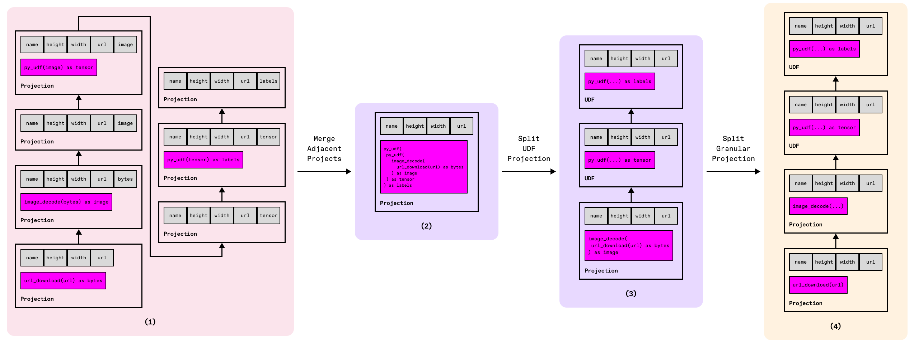
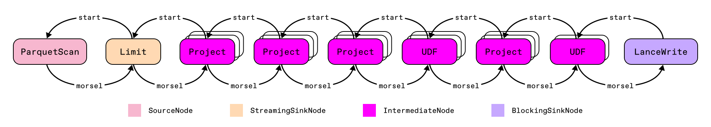

# Daft Architecture

Daft is a high-performance data engine designed for any modality and any scale. The architecture of Daft consists of 3 main layers: API, Planning, and Execution.


## API

Users express their workloads via the Python DataFrame API or the SQL interface. Internally, these are represented as a `LogicalPlan`: a tree of operators that describe *what* work should happen. Example operators include `Source`, `Project`, `Filter`, `GroupBy`, and `Join`.

Within each operator, especially the `Project` operator, there is a collection of expressions that define how data should be transformed. When users apply native functions (like `col("a") + 1`) or custom Python UDFs (such as `col("b").apply(my_udf)`), these are represented internally as nodes in an *expression tree*. Each node in the tree can be a column reference, a literal, a function call, or a UDF, and complex expressions are built by chaining these nodes together.

For example, consider the following user code:

```python
import daft
from daft import col

df = daft.from_pydict({"a": [1, 2, 3]})
result = df.select((col("a") + 1).alias("a_plus_one"))
result.explain()
```

Internally, this becomes a simple expression attached to the `Project` operator:

```{title="Output"}
* Project: col(a) + lit(1) as a_plus_one
|
* Source:
|   Number of partitions = 1
|   Output schema = a#Int64
```

## Optimization

Executing the logical plan as written would be correct but often inefficient. Daft applies both rule-based and cost-based optimization when a materializing operation such as `collect()` or `write_parquet()` is invoked.

- **Rule-based pass.** Classical rewrite rules execute first: filter, projection, limit, and aggregation pushdowns; projection folding and splitting; pruning redundant repartitions; expression simplification; and subquery unnesting. These transform the plan structure without needing runtime statistics.
- **Cost-based pass.** Joins are reordered using a brute-force enumerator that evaluates the cheapest ordering based on available statistics calculated from sources.
- **Multimodal awareness.** Expensive projections such as Python UDFs, model inference, URL downloads, image decoding, and similar operators are isolated into dedicated logical nodes. They are intentionally *not* pushed into scans so that execution can batch, schedule, and backpressure them independently. Such operations are executed as late as correctness permits (after joins, aggregations, etc.) to reduce wasted work on discarded rows.



This hybrid optimizer lets users focus on declarative queries while still obtaining efficient plans tailored to multimodal workloads.

## Execution

Once optimization completes, the plan is executed by either the native runner (single-machine) or the Ray runner (distributed).

### Native Runner (aka Swordfish)

The native runner is a streaming execution engine implemented in Rust, using the [Tokio](https://tokio.rs/) runtime for async I/O and multithreaded operations.



Given a plan, the native runner constructs a graph of operators, where each operator corresponds to a node in the plan. Operators send data up the graph via async channels.
Once the graph is constructed, the runner initiates execution, which typically follows this pattern:

- Source operators read data from local files or object stores and emit them in batches.
- Intermediate operators (e.g. Project, Filter, UDF) receive batches of data from previous operators, immediately transform them, and send them to the next operator.
- Sinks receive and accumulate batches of data. Streaming sinks (e.g. Limit) can emit early, while blocking sinks (e.g. Aggregate, Sort) only emit results once all input has been processed.

Operators determine their own parallelism and batching, and the engine schedules work across operators on a threadpool (Tokio).

### Ray Runner (aka Flotilla)

The Ray runner is a distributed execution engine built on top of Ray.


A Ray cluster contains a single head node, and all other nodes are worker nodes. On each worker node, Daft launches a single Ray actor that hosts an instance of the Swordfish engine.

The Flotilla scheduler runs on the head node and distributes tasks across workers, monitors progress, and orchestrates data movement when needed. Each task corresponds to a partition of the DataFrame, and tasks are assigned based on data locality and worker load, so computation runs close to the data while keeping cluster resources balanced. The number of partitions typically corresponds to the number of input files.

!!! tip "Controlling partitioning"

    See our [Partitioning and Batching guide](../optimization/partitioning.md) to learn how to control the number and distribution of partitions in your DataFrame


Each worker receives tasks and executes them using the Swordfish streaming engine with full access to the machine's resources. Outputs of the tasks are written to Ray's object store, and can be moved between workers for global operations like groupbys and joins.
