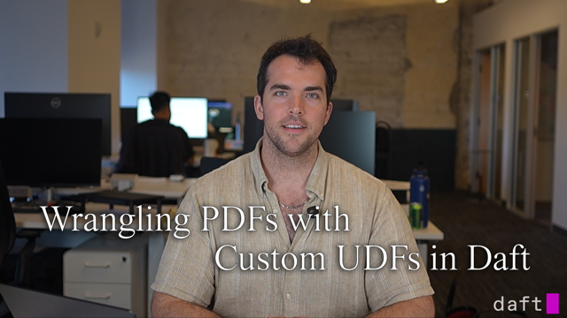

# Document Processing with Daft

<div class="grid cards examples" markdown>

- [ Run this tutorial on Google Colab](https://colab.research.google.com/github/Eventual-Inc/Daft/blob/main/tutorials/document_processing/document_processing_tutorial.ipynb)

- [ Follow along with the tutorial video](https://youtu.be/BLcKDQRTFKY)

</div>

👋 Hello and welcome to [Daft](http://www.daft.ai/)! This tutorial shows how to use Daft to create a typical PDF processing pipeline. By the end of the tutorial, we will have a fully functional pipeline that:

- [Starts with downloading PDFs from an S3](#downloading-pdfs)
- [Extracts text boxes either using OCR or by reading the file format](#loading-and-parsing-pdfs-using-udfs)
- [Performs spatial layout analysis to group text boxes into either lines or paragraphs](#document-processing)
- [Computes embeddings using a lightweight LLM, running locally](#text-embedding)
- [Saves everything as Parquet files](#writing-to-parquet)


**tl;dr**: If you'd like, you can [jump to the end to see the full pipeline](#entire-end-to-end-pipeline).

## Installing and Importing Dependencies

Before we see any code, let's install Daft and all of the dependencies we'll use in this tutorial!

```bash
pip install "daft[aws]" pillow pydantic PyMuPDF pytesseract sentence-transformers pydantic-to-pyarrow pdf2image accelerate
```

This is the complete set of imports that we'll use throughout this notebook tutorial. We'll evaluate them once here and reuse in the next cells.

```python
import io
import traceback
from collections.abc import Iterator
from datetime import datetime
from typing import Any, Optional, Union, get_args, get_origin

import fitz
import numpy as np
import pyarrow
import pytesseract
import torch
from PIL import Image
from pydantic import BaseModel
from pydantic_to_pyarrow import get_pyarrow_schema
from sentence_transformers import SentenceTransformer

import daft
from daft import Series, col, udf
```

## Our PDF Data

First, we get the S3 URLs for all of the PDFs that we'll use here.

```python
IO_CONFIG = daft.io.IOConfig(s3=daft.io.S3Config(anonymous=True))

df_sample = daft.from_glob_path(
    "s3://daft-public-data/tutorials/document-processing/industry_documents_library/pdfs/*",
    io_config=IO_CONFIG,
).limit(10)
```

To get a sense for what this data looks like, we can use the [`show`](https://docs.daft.ai/en/stable/api/dataframe/#daft.DataFrame.show) method on the `daft.DataFrame`. This doesn't materialize the entire DataFrame. Instead, it only does enough computation to show us the first 10 rows.

```python
df_sample.show()
```

### Downloading PDFs

We can use Daft to download these PDFs from S3 in parallel! Let's see what that looks like on this sample:

```python
df_sample = df_sample.collect()

_start = datetime.now()
df_sample_downloaded = df_sample.with_column("pdf_bytes", col("path").url.download(io_config=IO_CONFIG))
df_sample_downloaded = df_sample_downloaded.collect()
_end = datetime.now()
print(f"Downloaded {df_sample_downloaded.count_rows()} PDFs from S3 in {_end - _start}")

print(df_sample_downloaded)
```

Daft knows about URLs and has built-in support for downloading their contents! This is exposed via the [`.url.download()`](https://docs.daft.ai/en/stable/api/expressions/#daft.expressions.expressions.ExpressionUrlNamespace.download) method on a column expression (that's the [`col('path')`](https://docs.daft.ai/en/stable/api/expressions/#daft.expressions.col)).

### Pydantic Document Classes

Let's switch back to building out a document processing pipeline. We know that we can get the PDF bytes and load up each document. But, for our pipeline, we'd like to have a structured representation for the content we care about in each document. Namely, the text!

 Documents are two-dimensional: when doing document processing, we care about what the document says and _where_ it says it. What page? Where on the page? We can often make inferences on what role a piece of text fills by where it occurs on a page. For example, if we're processing forms, something right next to the "First Name:" field is _probably_ someone's first name.

 If we're doing ML after this pipeline, we will absolutely want to provide this spatial information to our model.

 So, before we can define any steps in our pipeline, we will need to define some Pydantic classes to help us represent a document!

```python
class BoundingBox(BaseModel):
    x: int
    y: int
    w: int
    h: int


class TextBlock(BaseModel):
    text: str
    bounding_box: BoundingBox


class DPI(BaseModel):
    height: float
    width: float


class ImageSize(BaseModel):
    width: int
    height: int
    dpi: DPI


class ParsedPage(BaseModel):
    page_index: int
    text_blocks: list[TextBlock]
    image_size: Optional[ImageSize]


class ParsedPdf(BaseModel):
    pdf_path: Optional[str] = None
    total_pages: int
    pages: list[ParsedPage]


class TextLine(BaseModel):
    words: list[TextBlock]
    bounding_box: BoundingBox


class IndexedTextBlock(BaseModel):
    index: int
    text: TextBlock


class Processed(BaseModel):
    page_index: int
    indexed_texts: list[IndexedTextBlock]
```

### Generating Daft Datatypes from Pydantic

We also need to define a function that will let us easily generate Daft DataTypes from our Pydantic classes using PyArrow. We'll use this function, `daft_pyarrow_datatype`, to let us automatically generate the [`daft.DataType`](https://docs.daft.ai/en/stable/api/datatypes/):

```python
def daft_pyarrow_datatype(f_type: type[Any]) -> daft.DataType:
    return daft.DataType.from_arrow_type(pyarrow_datatype(f_type))


def pyarrow_datatype(f_type: type[Any]) -> pyarrow.DataType:
    if get_origin(f_type) is Union:
        targs = get_args(f_type)
        if len(targs) == 2:
            if targs[0] is type(None) and targs[1] is not type(None):
                refined_inner = targs[1]
            elif targs[0] is not type(None) and targs[1] is type(None):
                refined_inner = targs[0]
            else:
                raise TypeError(f"Cannot convert a general union type {f_type} into a pyarrow.DataType!")
            inner_type = pyarrow_datatype(refined_inner)
        else:
            raise TypeError(f"Cannot convert a general union type {f_type} into a pyarrow.DataType!")

    elif get_origin(f_type) is list:
        targs = get_args(f_type)
        if len(targs) != 1:
            raise TypeError(
                f"Expected list type {f_type} with inner element type but " f"got {len(targs)} inner-types: {targs}"
            )
        element_type = targs[0]
        inner_type = pyarrow.list_(pyarrow_datatype(element_type))

    elif get_origin(f_type) is dict:
        targs = get_args(f_type)
        if len(targs) != 2:
            raise TypeError(
                f"Expected dict type {f_type} with inner key-value types but got " f"{len(targs)} inner-types: {targs}"
            )
        kt, vt = targs
        pyarrow_kt = pyarrow_datatype(kt)
        pyarrow_vt = pyarrow_datatype(vt)
        inner_type = pyarrow.map_(pyarrow_kt, pyarrow_vt)

    elif get_origin(f_type) is tuple:
        raise TypeError(f"Cannot support tuple types: {f_type}")

    elif issubclass(f_type, BaseModel):
        schema = get_pyarrow_schema(f_type)
        inner_type = pyarrow.struct([(f, schema.field(f).type) for f in schema.names])

    elif issubclass(f_type, str):
        inner_type = pyarrow.string()

    elif issubclass(f_type, int):
        inner_type = pyarrow.int64()

    elif issubclass(f_type, float):
        inner_type = pyarrow.float64()

    elif issubclass(f_type, bool):
        inner_type = pyarrow.bool_()

    elif issubclass(f_type, bytes):
        inner_type = pyarrow.binary()

    elif issubclass(f_type, datetime):
        inner_type = pyarrow.date64()

    else:
        raise TypeError(f"Cannot handle general Python objects in Arrow: {f_type}")

    return inner_type
```

We will use daft_pyarrow_datatype when we define the return_dtype in our upcoming user-defined functions (UDF)!

## Loading and Parsing PDFs using UDFs

The first part of our pipeline is to load the PDF's contents, locate all text, and put these results into our `ParsedPdf` class.

This procedure can either perform OCR to locate text boxes or it can inspect the PDF and, if it is supported, directly extract text boxes. Note that there are no guarantees that a PDF will support text. And if supported, there are no guarantees that the text boxes will make sense from a human readability standpoint.

We will create a user defined function (UDF) to allow Daft to load and parse our PDFs. This UDF, `LoadDirectAndParsePdf`, will use supporting functions for performing OCR with Tesseract or for extracting text out of the file via PyMuPDF.


```python
# Daft needs you to tell it what the expected output of any UDF looks like.
# We do this by specifying the return_dtype value.
#
# We're using our:
#     (a) automatic Pydantic-to-Daft datatype function
#     (b) Pydantic class
#
#                   (a) here
#                  ⌄⌄⌄⌄⌄⌄⌄⌄⌄⌄⌄⌄⌄⌄⌄⌄⌄⌄⌄⌄
#                                        (b) and here!
#                                       ⌄⌄⌄⌄⌄⌄⌄⌄⌄
@udf(return_dtype=daft_pyarrow_datatype(ParsedPdf))
class LoadDirectAndParsePdf:
    def __init__(self, ocr: bool, page_limit: Optional[int]) -> None:
        self.ocr = ocr
        self.page_limit = page_limit

    def handle(self, url: str, pdf_bytes: bytes) -> ParsedPdf:
        bytes_buffer = io.BytesIO(pdf_bytes)
        with fitz.open(stream=bytes_buffer, filetype="pdf") as pdf:
            if self.ocr:
                parsed_doc = ocr_document(pdf, page_limit=self.page_limit)
            else:
                parsed_doc = process_all_pages(pdf, page_limit=self.page_limit, get_image_info=False)
        parsed_doc.pdf_path = url
        return parsed_doc

    def __call__(self, urls: Series, pdf_bytes: Series) -> Series:
        return Series.from_pylist(
            # NOTE: it is **vital** to call .model_dump() on each Pydantic class.
            #       Daft handles converting the data into an Arrow record, using
            #       the DataType derived from the Pydantic class. However, it
            #       expects the data to be in a regular Python dictionary.
            [self.handle(u, p).model_dump() for u, p in zip(urls, pdf_bytes)]
        )


def ocr_document(doc: fitz.Document, *, page_limit: Optional[int] = None) -> ParsedPdf:
    pages: list[ParsedPage] = []
    for page_index in range(min(page_limit, len(doc)) if page_limit is not None else len(doc)):
        image = rasterize_page(doc, page_index)
        dpi_height, dpi_width = image.info.get("dpi", (72, 72))
        dpi = DPI(height=dpi_height, width=dpi_width)
        text_blocks = ocr_page(image)
        ocred_page = ParsedPage(
            page_index=page_index,
            text_blocks=text_blocks,
            image_size=ImageSize(
                width=image.width,
                height=image.height,
                dpi=dpi,
            ),
        )
        pages.append(ocred_page)

    return ParsedPdf(
        pdf_path=None,
        total_pages=len(doc),
        pages=pages,
    )


def rasterize_page(doc: fitz.Document, page_index: int, scale: float = 2.0) -> Image.Image:
    if page_index >= len(doc) or page_index < 0:
        raise ValueError(f"Page {page_index} does not exist. PDF has {len(doc)} pages.")

    page = doc[page_index]

    # Create transformation matrix for scaling
    mat = fitz.Matrix(scale, scale)

    # Render page to pixmap
    pix = page.get_pixmap(matrix=mat)

    img_data = pix.tobytes("png")
    image = Image.open(io.BytesIO(img_data))
    return image


def ocr_page(image: Image.Image) -> list[TextBlock]:
    results = []
    data = pytesseract.image_to_data(image, output_type=pytesseract.Output.DICT)
    for i in range(len(data["text"])):
        text_content = data["text"][i].strip()
        if text_content:
            text_block = TextBlock(
                text=text_content,
                bounding_box=BoundingBox(
                    x=data["left"][i],
                    y=data["top"][i],
                    h=data["height"][i],
                    w=data["width"][i],
                ),
            )
            results.append(text_block)
    return results


def process_all_pages(
    doc: fitz.Document,
    *,
    page_limit: Optional[int] = None,
    get_image_info: bool = True,
) -> ParsedPdf:
    pages: list[ParsedPage] = []

    for page_index in range(min(len(doc), page_limit) if page_limit is not None else len(doc)):
        text_data = extract_text_with_bbox(doc, page_index)

        if get_image_info:
            image = rasterize_page(doc, page_index)

            dpi_height, dpi_width = image.info.get("dpi", (72, 72))
            dpi = DPI(height=dpi_height, width=dpi_width)

            maybe_image_size = ImageSize(
                width=image.width,
                height=image.height,
                dpi=dpi,
            )

        else:
            maybe_image_size = None

        page_data: ParsedPage = ParsedPage(
            page_index=page_index,
            text_blocks=text_data,
            image_size=maybe_image_size,
        )

        pages.append(page_data)

    return ParsedPdf(pdf_path=None, total_pages=len(doc), pages=pages)


def extract_text_with_bbox(doc: fitz.Document, page_index: int) -> list[TextBlock]:
    if page_index >= len(doc) or page_index < 0:
        raise ValueError(f"Page {page_index} does not exist. PDF has {len(doc)} pages.")

    page = doc[page_index]
    text_blocks = []

    # Get text blocks with their rectangles
    blocks = page.get_text("dict")  # type: ignore

    for block in blocks.get("blocks", []):
        if "lines" in block:  # Text block
            for line in block["lines"]:
                for span in line["spans"]:
                    # Extract text and bounding box
                    text = span["text"].strip()
                    if text:
                        bbox = span["bbox"]
                        text_block = TextBlock(
                            text=text,
                            bounding_box=BoundingBox(
                                x=int(bbox[0]),
                                y=int(bbox[1]),
                                w=int(bbox[2] - bbox[0]),
                                h=int(bbox[3] - bbox[1]),
                            ),
                        )
                        text_blocks.append(text_block)

    return text_blocks
```

### Sample on first PDF

Let's see what it looks like to perform OCR and extract text from the first PDF in our collection.

```python
df_first_1 = df_sample.limit(1)
df_first_1 = df_first_1.with_column("pdf_bytes", df_first_1["path"].url.download(io_config=IO_CONFIG))
df_first_1 = df_first_1.collect()
print(df_first_1)

pdf = fitz.open(stream=io.BytesIO(df_first_1.to_pylist()[0]["pdf_bytes"]), filetype="pdf")
```

```python
ocr_text_boxes = ocr_document(pdf, page_limit=1).pages[0]
print(f"{len(ocr_text_boxes.text_blocks)} OCR'd text boxes on the first page. Sample:")
for i in range(25):
    tb = ocr_text_boxes.text_blocks[i]
    print(f"text='{tb.text}' {tb.bounding_box}")
```

```python
extracted_text_boxes = process_all_pages(pdf, page_limit=1, get_image_info=False).pages[0]
print(f"{len(extracted_text_boxes.text_blocks)} text boxes listed in PDF on the first page. Sample:")
for i in range(25):
    tb = extracted_text_boxes.text_blocks[i]
    print(f"text='{tb.text}' {tb.bounding_box}")
```

```python
pdf.close()
```

## Document Processing

Now that we can load PDFs and format them into our `ProcessedPdf` Pydantic class, we can start to define the steps of our document processing pipeline!

Here, we will define the `DocProcessor` UDF, which uses spatial heuristics to group the extracted `TextBlock`s into more coherent and usable groups of text. We also make sure to sort the text into reading order, which we define here as left-to-right, top-to-bottom. We can choose to only group things into lines (only looking at the Y axis). Or we can choose to group into paragraphs (looking at the Y and X axes).

These heuristics have controllable thresholds (`row_tolerance` for the lines and `{x,y}_thresh` for the paragraph grouping). They _will not_ work in all usecases and domains! In general, Document Layout Analysis is hard. There are excellent research models for performing layout analysis which can easily be ran with Daft :), but we'll save that for another day!

Below is the code for this UDF and its supporting helper functions.

```python
class PipelineConfig(BaseModel):
    row_tolerance: int = 10
    y_thresh: int = 15
    x_thresh: int = 60
    group_paragraphs: bool = True


@udf(return_dtype=daft_pyarrow_datatype(list[Processed]))
class DocProcessor:
    def __init__(self, *, row_tolerance: int, y_thresh: int, x_thresh: int, group_paragraphs: bool) -> None:
        self.row_tolerance = row_tolerance
        self.y_thresh = y_thresh
        self.x_thresh = x_thresh
        self.group_paragraphs = group_paragraphs

    def handle(self, doc: Union[ParsedPdf, dict]) -> Iterator[Processed]:
        parsed_doc = ParsedPdf.model_validate(doc) if isinstance(doc, dict) else doc
        for page_index, page in enumerate(parsed_doc.pages):
            text_blocks = page_pipeline(
                page,
                row_tolerance=self.row_tolerance,
                y_thresh=self.y_thresh,
                x_thresh=self.x_thresh,
                group_paragraphs=self.group_paragraphs,
            )
            yield Processed(
                page_index=page_index,
                indexed_texts=[IndexedTextBlock(index=i, text=t) for i, t in enumerate(text_blocks)],
            )

    def __call__(self, parsed: Series) -> Series:
        return Series.from_pylist(
            # Again, note the call to .model_dump() on each Pydantic object.
            [[processed.model_dump() for processed in self.handle(doc)] for doc in parsed]
        )


def page_pipeline(
    parsed_page: ParsedPage,
    *,
    row_tolerance: int,
    y_thresh: int,
    x_thresh: int,
    group_paragraphs: bool,
) -> list[TextBlock]:
    reading_order_text_blocks = sort_bounding_boxes_reading_order(parsed_page.text_blocks, row_tolerance=row_tolerance)
    text_lines: list[TextLine] = group_into_text_lines(
        reading_order_text_blocks,
        y_thresh=y_thresh,
        x_thresh=x_thresh,
    )

    if group_paragraphs:
        simplified_text_lines = group_into_paragraphs(text_lines, row_tolerance=row_tolerance)
    else:
        simplified_text_lines = [revert_to_tb(tl) for tl in text_lines]

    final_texts = sort_bounding_boxes_reading_order(simplified_text_lines, row_tolerance=row_tolerance)

    return final_texts


def sort_bounding_boxes_reading_order(boxes: list[TextBlock], *, row_tolerance: int) -> list[TextBlock]:
    """Sort a list of BoundingBox objects into reading order (left-to-right, top-to-bottom).

    This function implements a multi-line sorting algorithm that:
    1. Groups bounding boxes by approximate row (within a tolerance)
    2. Sorts boxes within each row from left to right
    3. Sorts rows from top to bottom

    Args:
        boxes: list of BoundingBox objects to sort
        row_tolerance: Tolerance for grouping boxes into the same row (in pixels)
                       Adjust this value based on your document's line spacing.

    Returns:
        list of BoundingBox objects sorted in reading order
    """
    if not boxes:
        return []

    boxes = boxes.copy()

    # Group boxes by approximate row
    rows: dict[int, list[TextBlock]] = {}

    for tbox in boxes:
        # Find which row this box belongs to
        placed = False
        for row_y, tboxes_in_row in rows.items():
            if abs(tbox.bounding_box.y - row_y) <= row_tolerance:
                tboxes_in_row.append(tbox)
                placed = True
                break

        if not placed:
            # Create a new row
            rows[tbox.bounding_box.y] = [tbox]

    # Sort each row from left to right
    for row_y, tboxes_in_row in rows.items():
        tboxes_in_row.sort(key=lambda box: box.bounding_box.x)

    # Sort rows from top to bottom
    finished_rows = [(row_y, tboxes_in_row) for row_y, tboxes_in_row in rows.items()]
    finished_rows.sort(key=lambda x: x[0])

    # Flatten the result
    result: list[TextBlock] = []
    for _, tboxes_in_row in finished_rows:
        result.extend(tboxes_in_row)

    return result


def group_into_text_lines(
    reading_order_text_boxes: list[TextBlock],
    *,
    y_thresh: int,
    x_thresh: int,
) -> list[TextLine]:
    # Group into lines
    lines: list[list[TextBlock]] = []
    for word in reading_order_text_boxes:
        assigned = False
        for line in lines:
            last_word: TextBlock = line[-1]
            same_line_y: bool = abs(word.bounding_box.y - last_word.bounding_box.y) <= y_thresh
            close_x: bool = word.bounding_box.x - (last_word.bounding_box.x + last_word.bounding_box.w) <= x_thresh
            if same_line_y and close_x:
                line.append(word)
                assigned = True
                break

        if not assigned:
            lines.append([word])

    # Aggregate lines with bounding boxes
    results: list[TextLine] = [form_text_line(line_words) for line_words in lines]

    return results


def form_text_line(line_words: list[TextBlock]) -> TextLine:
    xs: list[int] = [w.bounding_box.x for w in line_words]
    ys: list[int] = [w.bounding_box.y for w in line_words]
    ws: list[int] = [w.bounding_box.w for w in line_words]
    hs: list[int] = [w.bounding_box.h for w in line_words]

    x_min = min(xs)
    y_min = min(ys)
    x_max = max(x + w for x, w in zip(xs, ws))
    y_max = max(y + h for y, h in zip(ys, hs))

    return TextLine(
        words=line_words,
        bounding_box=BoundingBox(x=x_min, y=y_min, w=x_max - x_min, h=y_max - y_min),
    )


def group_into_paragraphs(text_lines: list[TextLine], *, row_tolerance: int) -> list[TextBlock]:
    paragraphs: list[list[TextLine]] = []
    for tl in text_lines:
        assigned = False
        for p_group in paragraphs:
            p = p_group[-1]
            if abs(p.bounding_box.y + p.bounding_box.h - tl.bounding_box.y) <= row_tolerance:
                p_group.append(tl)
                assigned = True
                break
        if not assigned:
            paragraphs.append([tl])

    simplified_text_lines: list[TextBlock] = []
    for p_group in paragraphs:
        tbs: list[TextBlock] = [revert_to_tb(tl) for tl in p_group]
        paragraph: TextBlock = revert_to_tb(form_text_line(tbs))
        simplified_text_lines.append(paragraph)

    return simplified_text_lines


def revert_to_tb(tl: TextLine) -> TextBlock:
    return TextBlock(
        text=" ".join(w.text for w in tl.words),
        bounding_box=tl.bounding_box,
    )
```

## Text Embedding

Now that we have nice groups of text, we can generate embeddings for them! We will define a functor that makes a UDF from a `SentenceTransformer` model. The resulting UDF will make sure that the generated values are (1) of a fixed size and (2) of a known datatype (your classic 32-bit floating point number!).

```python
@udf(
    return_dtype=daft.DataType.embedding(daft.DataType.float32(), 384),
    num_gpus=1,
    concurrency=1,  # setting concurrency to initialize model once
)
class TextEmbedder:
    def __init__(self, model_name: str):
        model = SentenceTransformer(model_name)
        model.to("cuda")
        model.eval()

        try:
            model.compile()
        except Exception:
            print("Could not torch.compile the SentenceTransformer model. " "Proceeding with unoptimized inference.")
            traceback.print_exc()

        self.model = model

    def __call__(self, texts: Series) -> Series:
        with torch.no_grad():
            embeddings: np.ndarray[float] = self.model.encode(
                texts.to_pylist(), convert_to_numpy=True, show_progress_bar=False
            )
        return Series.from_numpy(embeddings)
```

## Entire End-to-End Pipeline

In Daft, we express our pipeline as a `daft.DataFrame` instance. We use the DataFrame's methods to produce transformations from one view of the data into another. Here, we'll combine all of the functionality defined in this tutorial into a complete DataFrame-based pipeline.


### Options
We will start out by defining the configuration options our pipeline uses -- change _any_ of these values and rerun to see how they affect the pipeline!

```python
# Uses Tesseract to perform OCR if true. Otherwise tries to get text
# directly from the file format.
ocr: bool = False

# Only handle the first 10 pages of each PDF. Some PDFs are very long and
# can bog-down the pipeline as it waits for stragglers. For fast exploration,
# set this limit. If you want to run on all pages of each PDF, set this to None.
page_limit: Optional[int] = 10

# Determine how text boxes are grouped together to form more semantically
# relevant passages of text. These options control heuristics in the
# DocProcessor UDF. Increasing the thresholds and tolerance will cause more
# distance text boxes to be grouped together.
config = PipelineConfig(
    row_tolerance=10,
    y_thresh=15,
    x_thresh=60,
    group_paragraphs=True,
)

# The text embedding model to use. See HuggingFace for a more complete list!
model_name = "all-MiniLM-L6-v2"
```

Checking some assumptions on our options for the dataframe-based processing pipeline:

```python
if page_limit is not None:
    if page_limit <= 0:
        raise ValueError(f"Page limit must be positive if specified! Invalid: {page_limit=}")
    print(f"Limiting each PDF to the first {page_limit} pages.")
```

### Step 1: Enumerate S3 Keys

Read the S3 bucket & key prefix and get full keys.

```python
df = daft.from_glob_path(
    "s3://daft-public-data/tutorials/document-processing/industry_documents_library/pdfs/*",
    io_config=IO_CONFIG,
)

print(df.schema())
```

### Step 2: Download PDFs

Downloads the contents of each PDF file:

```python
df = df.select("path").with_column_renamed("path", "url")
df = df.with_column("pdf_bytes", col("url").url.download(io_config=IO_CONFIG))
print(df.schema())
```

### Step 3: Load PDFs, Maybe Apply OCR

Use the PDF and OCR libraries to load all of the documents and extract text boxes on their pages:

```python
df = df.with_column(
    "parsed",
    # NOTE: We can easily define a UDF that operates on multiple columns!
    #
    #       This UDF mainly uses the downloaded PDF contents, but it also
    #       includes the URL to make a well-formed ParsedPdf instance.
    #
    #       We're configuring how the UDF operates by supplying the
    #       constructor arguments using the `with_init_args` class method.
    #
    #       These arguments are applied here   and here
    #                                    ⌄⌄⌄  ⌄⌄⌄⌄⌄⌄⌄⌄⌄⌄
    LoadDirectAndParsePdf.with_init_args(ocr, page_limit)(col("url"), col("pdf_bytes")),
    #       We're providing the two columns to our UDF
    #                                                     ^^^^^^^^^^  ^^^^^^^^^^^^^^^^
    #                                                         here        and here
).exclude("pdf_bytes")
print(df.schema())
```

#### UDF Application

A note on how Daft works -- in our above UDF application, we're providing column expressions as input. Specifically, the [`col`](../api/expressions.md#daft.expressions.col) part. When we write `col("url")`, we're telling Daft to wire things up under the hood to reference the data in the `url` column of the dataframe.

Breaking down the PDF loading and parsing UDF call, the first part is actually constructing the UDF instance:
```python
LoadDirectAndParsePdf.with_init_args(ocr, page_limit)
```

While the second part is actually applying that UDF to our two columns, `url` and `pdf_bytes`:
```python
(col("url"), col("pdf_bytes"))
```

Note that this is equivalent:
```python
f = LoadDirectAndParsePdf.with_init_args(ocr, page_limit)
f(col("url"), col("pdf_bytes"))
```

### Step 4: Text Box Processing

Process the parsed document representation: perform custom logic grouping text boxes into more cohesive units (e.g. lines or paragraphs). Configurable grouping logic uses spatial information to determine each text box's group membership.

```python
df = df.with_column(
    "processed_raw",
    DocProcessor.with_init_args(**config.model_dump())(col("parsed")),
).exclude("parsed")
print(df.schema())
```

Reformat the text boxes structured objects (the ParsedPdf pydantic class instances) into rows. Each row has the reading order index, the text, the page index, and the bounding box coordinates.

```python
df = (
    df.explode("processed_raw")
    .with_column("page_index", col("processed_raw").struct.get("page_index"))
    .with_column("indexed_texts", col("processed_raw").struct.get("indexed_texts"))
    .explode("indexed_texts")
    .exclude("processed_raw")
)
print(df.schema())
```

#### Explaining Structure Access Expressions

Note that we're using [`.struct`](../api/expressions.md#daft.expressions.struct) to construct an expression that allows Daft to extract individual field values from our complex document structure.

When write `col("text_blocks").struct.get("bounding_box")`, we're telling Daft that we want to access the `bounding_box` field of each element from the `text_blocks` column. From this, we can provide additional field-selecting logic (e.g. `["x"]` to get the value for field `x` on the `bounding_box` value from each structure in `text_blocks`).

The last part of our text box processing step is to extract the text and bounding box coordinates into their own columns. We also want to preserve the reading order index as its own column too.

This format makes it easier to form follow up queries on our data, such as:
"what are the first 10 pieces of text on the first page of each document?" or
"what text appears in the bottom-right quadrant of each page?"

```python
df = (
    df.with_column("text_blocks", col("indexed_texts").struct.get("text"))
    .with_column("reading_order_index", col("indexed_texts").struct.get("index"))
    .exclude("indexed_texts")
    .with_column("text", col("text_blocks").struct.get("text"))
    .with_column("x", col("text_blocks").struct.get("bounding_box")["x"])
    .with_column("y", col("text_blocks").struct.get("bounding_box")["y"])
    .with_column("h", col("text_blocks").struct.get("bounding_box")["h"])
    .with_column("w", col("text_blocks").struct.get("bounding_box")["w"])
    .exclude("text_blocks")
)
print(df.schema())
```

### Step 5: Text Embeddings

The final step is to produce embeddings for each piece of text:

```python
embedder = TextEmbedder.with_init_args(model_name=model_name)
df = df.with_column("embeddings", embedder(col("text")))
```

## Executing a Lazily Constructed Pipeline

At this point, our `df` value contains the entire pipeline. We can show the final schema with a simple method call:

```python
print(f"Pipeline constructed:\n{df.schema()}")
```

And we can peek under the hood and ask Daft to show us the entire logical plan  that it will run when we ask it to execute our pipeline:

```python
print(f"Execution plan for pipeline:\n{df.explain()}")
```

### Writing to Parquet

In Daft, [DataFrames are _lazy_](https://docs.daft.ai/en/stable/quickstart/#execute-your-dataframe-and-view-data): they are only evaluated once it is necessary.

By invoking the [`write_parquet`](https://docs.daft.ai/en/stable/api/io/#daft.dataframe.DataFrame.write_parquet) method, we force the DataFrame to evaluate so that its contents can be written out to disk!

If we wanted to keep the values in-memory, we would call [`.collect()`](https://docs.daft.ai/en/stable/api/io/#daft.dataframe.DataFrame.collect) on the DataFrame. This process is known as _materializing the DataFrame_. Note that the `collect` method returns a new DataFrame holding the actual computed values.

```python
output_dir = "./doc_proc_tutorial_parquet"
print(f"Writing out as Parquet files to: {output_dir}")

parquet_out = df.write_parquet(output_dir).to_pydict()
print(f"Complete! Wrote {df.count_rows()} rows:\n{parquet_out}")
```
