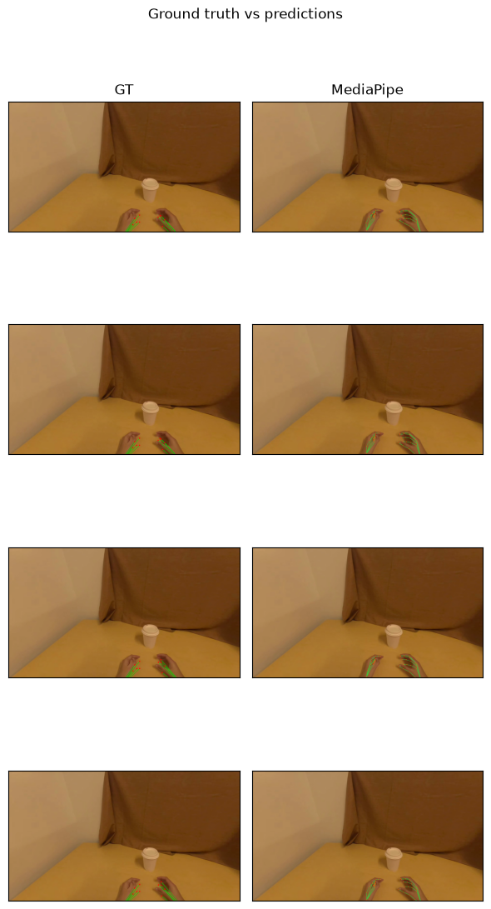

# Hand Tracking for Physical AI

This example uses [daft-physical-ai](https://github.com/Eventual-Inc/daft-physical-ai), a Daft extension for physical AI data pipelines. It reads a LeRobot dataset, runs hand tracking (MediaPipe) as a Daft UDF with `track_hands`, and shows the keypoints.

## Setup

Install with `pip install "daft-physical-ai[mediapipe]" matplotlib`, then import.

```python
from daft.datasets import lerobot

from daft_physical_ai.hands import track_hands
```

## Configure

The dataset, the camera column to decode, and how many frames to run.

```python
DATASET = "pepijn223/egodex-test"
IMAGE_COLUMN = "observation.image"
LIMIT = 12
```

## Read the dataset

The LeRobot reader gives one row per frame, decoding the camera into an image column.

```python
df = lerobot.read(DATASET, load_video_frames=IMAGE_COLUMN).limit(LIMIT)
```

## Track hands

`track_hands` returns a hand-pose column: a list of `{handedness, confidence, kp2d, kp3d?}` per frame (`kp3d` is null for MediaPipe). It's a lazy, batched Daft UDF, so nothing runs until we materialize below.

```python
df = df.with_column("hands", track_hands(df[IMAGE_COLUMN], method="mediapipe"))
```

## Inspect the results

`.show()` triggers execution and renders the keypoints per frame.

```python
df.select("episode_index", "frame_index", "hands").show()
```

| episode_index | frame_index | hands |
| --- | --- | --- |
| 0 | 0 | `[{handedness: right, confidence: 0.9790868, kp2d: [[1409.5848, 1109.521], ...], kp3d: None, }, {handedness: right, confidence: 0.7482122, kp2d: [[954.672, 1074.0482], ...], kp3d: None, }]` |
| 0 | 1 | `[{handedness: right, confidence: 0.98324096, kp2d: [[1406.2035, 1108.8458], ...], kp3d: None, }, {handedness: right, confidence: 0.76023126, kp2d: [[954.5771, 1071.5254], ...], kp3d: None, }]` |
| 0 | 2 | `[{handedness: right, confidence: 0.97795737, kp2d: [[1410.8853, 1107.5798], ...], kp3d: None, }, {handedness: right, confidence: 0.82196695, kp2d: [[953.91736, 1076.048], ...], kp3d: None, }]` |
| 0 | 3 | `[{handedness: right, confidence: 0.9760107, kp2d: [[1411.5732, 1105.092], ...], kp3d: None, }, {handedness: right, confidence: 0.82673466, kp2d: [[955.222, 1073.2001], ...], kp3d: None, }]` |
| 0 | 4 | `[{handedness: right, confidence: 0.9784236, kp2d: [[1411.9012, 1102.4144], ...], kp3d: None, }, {handedness: right, confidence: 0.79153925, kp2d: [[950.6265, 1077.1145], ...], kp3d: None, }]` |
| 0 | 5 | `[{handedness: right, confidence: 0.9766638, kp2d: [[1414.2744, 1107.02], ...], kp3d: None, }, {handedness: right, confidence: 0.8490106, kp2d: [[952.9871, 1075.4406], ...], kp3d: None, }]` |
| 0 | 6 | `[{handedness: right, confidence: 0.9718941, kp2d: [[1406.7915, 1108.6783], ...], kp3d: None, }, {handedness: right, confidence: 0.8631619, kp2d: [[953.58887, 1069.7833], ...], kp3d: None, }]` |
| 0 | 7 | `[{handedness: right, confidence: 0.9692566, kp2d: [[1408.7743, 1108.7031], ...], kp3d: None, }, {handedness: right, confidence: 0.8757248, kp2d: [[953.2748, 1069.3573], ...], kp3d: None, }]` |

## Evaluate against ground truth

EgoDex ships per-frame GT hand poses, so we can score the predictions: project both GT hands, match the predicted hands to them, and report detect% + PCK. The matching runs as a Daft UDF (`score`); the summary is computed from the collected results.

> EgoDex-specific (GT layout + camera intrinsics). Needs `pip install scipy`.

```python
# --- Evaluation against EgoDex ground truth (2D, wrist + 5 fingertips) ---
# EgoDex-specific: GT hand poses live in observation.state (left = dims 0-23,
# right = 24-47); the camera is observation.extrinsics. Needs scipy + numpy.
import numpy as np
from scipy.optimize import linear_sum_assignment

import daft
from daft import DataType, col

FX = FY = 736.6339          # EgoDex camera intrinsics
CX, CY = 960.0, 540.0
SIX = [0, 4, 8, 12, 16, 20]  # wrist + 5 fingertip keypoints
THRESH = [0.1, 0.2, 0.3]     # PCK thresholds (normalized)


def _hand_pts(state, side):
    b = side * 24            # 24 dims per hand: wrist(3) + joints; we take wrist + 5 tips
    return np.vstack([state[b : b + 3], state[b + 9 : b + 24].reshape(5, 3)])


def _project(points_world, extr):
    cam_from_world = np.linalg.inv(np.asarray(extr, float).reshape(4, 4))
    cam = (cam_from_world @ np.hstack([points_world, np.ones((len(points_world), 1))]).T).T[:, :3]
    z = cam[:, 2]
    with np.errstate(divide="ignore", invalid="ignore"):
        uv = np.stack([FX * cam[:, 0] / z + CX, FY * cam[:, 1] / z + CY], axis=1)
    uv[z <= 0] = np.nan
    return uv


def _norm(p):               # translation + scale invariant (hand size)
    p = p - p[0]
    return p / (np.linalg.norm(p[1:], axis=1).mean() + 1e-9)


def _pair_err(gt6, pred6):  # per-keypoint error, fingertips matched by assignment
    g, m = _norm(gt6), _norm(pred6)
    d = np.linalg.norm(g[1:, None] - m[None, 1:], axis=2)
    r, c = linear_sum_assignment(d)
    return np.concatenate([[0.0], d[r, c]])


_ERR = DataType.struct({
    "n_gt": DataType.int64(),
    "n_matched": DataType.int64(),
    "errs": DataType.list(DataType.list(DataType.float64())),
})


@daft.func(return_dtype=_ERR)
def score(hands, state, extr):
    """Match predicted hands to the 2 GT hands (Hungarian on normalized error)."""
    gts = [uv for uv in (_project(_hand_pts(np.asarray(state, float), s), extr) for s in (0, 1)) if np.isfinite(uv).all()]
    preds = [np.asarray(h["kp2d"], float)[SIX] for h in (hands or [])]
    if not gts or not preds:
        return {"n_gt": len(gts), "n_matched": 0, "errs": []}
    pair = [[_pair_err(g, p) for p in preds] for g in gts]
    cost = np.array([[e.mean() for e in row] for row in pair])
    r, c = linear_sum_assignment(cost)   # match predicted hands to GT hands
    return {"n_gt": len(gts), "n_matched": len(r), "errs": [[float(x) for x in pair[i][j]] for i, j in zip(r, c)]}


def report(label, scores):
    n_gt = sum(s["n_gt"] for s in scores)
    matched = sum(s["n_matched"] for s in scores)
    errs = [e for s in scores for hand in s["errs"] for e in hand]
    mean_errs = [float(np.mean(hand)) for s in scores for hand in s["errs"]]
    pck = [100 * np.mean([e < t for e in errs]) if errs else 0.0 for t in THRESH]
    detect = 100 * matched / n_gt if n_gt else 0.0
    mean = float(np.mean(mean_errs)) if mean_errs else float("nan")
    print(f"{label:12} detect={detect:3.0f}%  mean_err={mean:.3f}  "
          f"PCK@.1/.2/.3 = {pck[0]:.0f}/{pck[1]:.0f}/{pck[2]:.0f}")
```

```python
df = df.with_column("score_hands", score(col("hands"), col("observation.state"), col("observation.extrinsics")))
scored = df.select("score_hands").to_pydict()
```

```python
print("EgoDex 2D accuracy:")
report("MediaPipe", scored["score_hands"])
```

```
EgoDex 2D accuracy:
MediaPipe    detect=100%  mean_err=0.116  PCK@.1/.2/.3 = 49/84/96
```

## Visualize: ground truth vs predictions

Each row is a frame; the first column is the EgoDex ground-truth hands (green), the rest are the predicted keypoints. This is the most telling view - you see where each method is right and where it misses.

```python
# --- Visualize: draw the predicted keypoints on a few frames ---
import cv2
import matplotlib.pyplot as plt
import numpy as np

# 21-keypoint hand skeleton (wrist + 5 fingers x 4 joints)
BONES = [(0, 1), (1, 2), (2, 3), (3, 4), (0, 5), (5, 6), (6, 7), (7, 8),
         (0, 9), (9, 10), (10, 11), (11, 12), (0, 13), (13, 14), (14, 15),
         (15, 16), (0, 17), (17, 18), (18, 19), (19, 20)]


def draw_hands(img, hands):
    img = np.ascontiguousarray(img)
    for h in hands or []:
        kp = np.asarray(h["kp2d"], float)
        for a, b in BONES:
            cv2.line(img, tuple(kp[a].astype(int)), tuple(kp[b].astype(int)), (60, 200, 60), 2)
        for p in kp:
            cv2.circle(img, tuple(p.astype(int)), 3, (255, 80, 0), -1)
    return img

def draw_gt(img, state, extr):
    """Draw the projected EgoDex GT hands (wrist + fingertips) in green."""
    img = np.ascontiguousarray(img)
    for side in (0, 1):
        uv = _project(_hand_pts(np.asarray(state, float), side), extr)
        if not np.isfinite(uv).all():
            continue
        wrist = tuple(uv[0].astype(int))
        for tip in uv[1:]:
            cv2.line(img, wrist, tuple(tip.astype(int)), (0, 220, 0), 2)
            cv2.circle(img, tuple(tip.astype(int)), 5, (255, 0, 0), -1)
        cv2.circle(img, wrist, 6, (0, 120, 255), -1)
    return img
```

```python
viz = df.select(IMAGE_COLUMN, "observation.state", "observation.extrinsics", "hands").limit(4).to_pydict()
columns = [("GT", None)] + [("MediaPipe", "hands")]
n = len(viz["frame_index"]) if "frame_index" in viz else len(viz[IMAGE_COLUMN])
fig, axes = plt.subplots(n, len(columns), figsize=(3 * len(columns), 3 * n), squeeze=False)
for i in range(n):
    img = np.asarray(viz[IMAGE_COLUMN][i])
    for jc, (label, c) in enumerate(columns):
        cell = (draw_gt(img.copy(), viz["observation.state"][i], viz["observation.extrinsics"][i])
                if c is None else draw_hands(img.copy(), viz[c][i]))
        axes[i][jc].imshow(cell)
        axes[i][jc].set_xticks([])
        axes[i][jc].set_yticks([])
        if i == 0:
            axes[i][jc].set_title(label)
fig.suptitle("Ground truth vs predictions")
plt.tight_layout()
plt.show()
```


