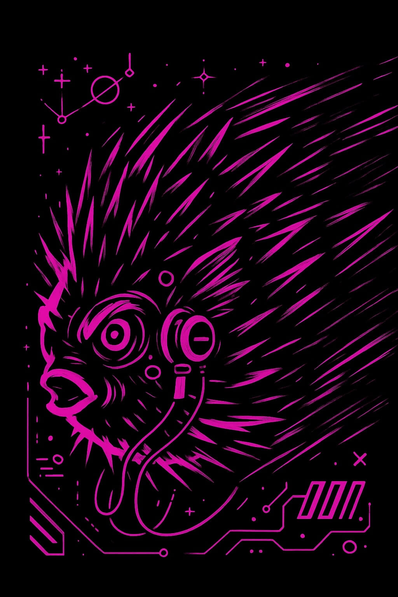
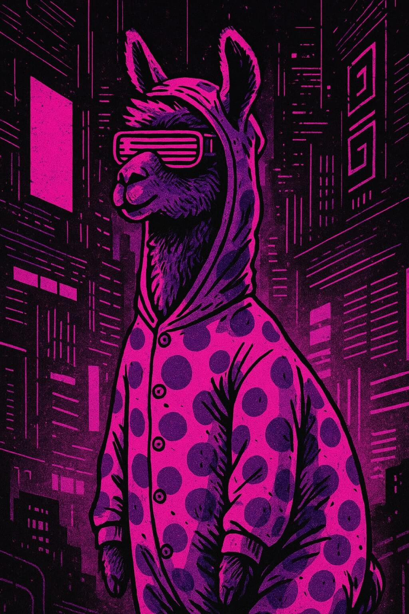
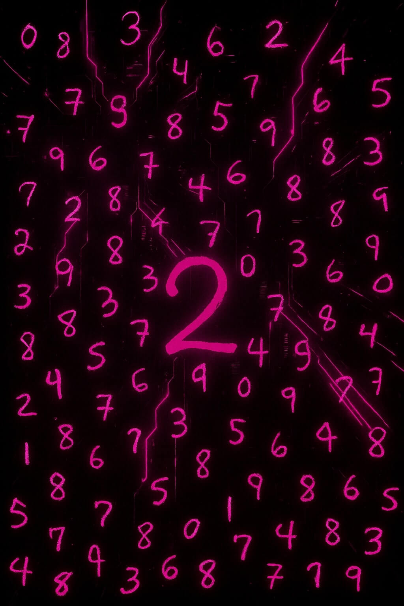

# Examples

  

    <a href="./document-processing" class="example-image-link">
      

        
        

          <h3>Document Processing</h3>
          
Load PDFs from S3, extract text, run layout analysis, and compute embeddings

        

      

    </a>
  

  

    <a href="./audio-transcription" class="example-image-link">
      

        
        

          <h3>Audio Transcription with Whisper</h3>
          
Effortlessly convert audio to text at scale

        

      

    </a>
  

  

    <a href="./text-embeddings" class="example-image-link">
      

        
        

          📊
        

        

          <h3>Text Embeddings for Turbopuffer</h3>
          
Generate embeddings on text to store in vector databases

        

      

    </a>
  

  

    <a href="./llms-red-pajamas" class="example-image-link">
      

        
        

          🤖
        

        

          <h3>LLMs on Hugging Face Datasets</h3>
          
Load Red Pajamas dataset and perform similarity search

        

      

    </a>
  

  

    <a href="./image-generation" class="example-image-link">
      

        
        

          🎨
        

        

          <h3>Generate Images with Stable Diffusion</h3>
          
Using text prompts with deep learning models

        

      

    </a>
  

  

    <a href="./querying-images" class="example-image-link">
      

        
        

          🔍
        

        

          <h3>Query Images</h3>
          
Retrieve the top N "reddest" images from the Open Images dataset

        

      

    </a>
  

  

    <a href="./mnist" class="example-image-link">
      

        
        

          🔢
        

        

          <h3>MNIST Digit Classification</h3>
          
Run classification with deep learning

        

      

    </a>
  

  

    <a href="./window-functions" class="example-image-link">
      

        
        

          📈
        

        

          <h3>Window Functions</h3>
          
Efficient window functions for ranking, computing deltas, and tracking cumulative sums

        

      

    </a>
  

