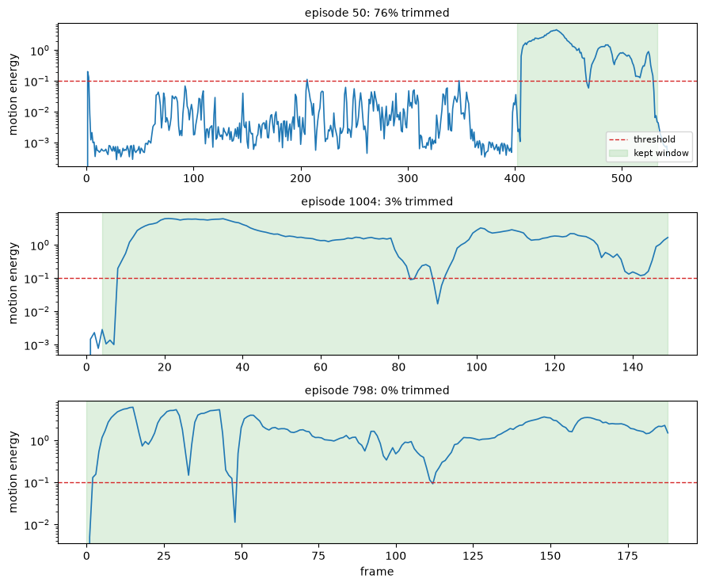

# Motion Trimming for Physical AI

This example uses [daft-physical-ai](https://github.com/Eventual-Inc/daft-physical-ai), a Daft extension for physical AI data pipelines. Robot episodes open with the operator setting up and end after the task is done - dead frames that cost decode time, VLM tokens, and training steps. The example finds them **without decoding video**: the robot's own joint positions live in parquet next to the mp4, and a still arm is a columnar scan away.

Two outputs, for two kinds of consumer: a per-frame `is_active` flag (for training that samples frames - drops interior pauses too) and one contiguous trim window per episode (for anything that decodes a video slice).

## Setup

Install with `pip install daft-physical-ai matplotlib`, then import.

```python
import daft
from daft import col
from daft.datasets import lerobot

from daft_physical_ai.proprio import is_active, motion_energy, motion_scale
from daft_physical_ai.trim import trim_windows
```

## Configure

The dataset, its state column, and how many of its data files to read. Everything streams from Hugging Face - the video is never touched.

```python
DATASET = "lerobot/droid_1.0.1"
STATE = "observation.state.joint_position"  # the robot's own joint positions, one list per frame
DIMS = 7
FPS = 15
SHARDS = 1  # data files to read (DROID has 156; one is ~1,000 episodes)
```

## Build the frame DataFrame

One row per frame: episode metadata from Daft's LeRobot reader joined to the per-frame parquet.

```python
root = f"hf://datasets/{DATASET}"
episodes = lerobot.read_episodes(root).select("episode_index", "dataset_from_index")
shards = [f"{root}/data/chunk-000/file-{i:03d}.parquet" for i in range(SHARDS)]
frames = episodes.join(daft.read_parquet(shards), on="episode_index")

# droid_1.0.1 quirk: some episodes carry an orphan second recording under the
# same episode_index. A canonical row sits exactly at dataset_from_index +
# frame_index; orphans never do, so one filter drops them.
frames = frames.where(col("index") == col("dataset_from_index") + col("frame_index"))
frames = frames.select("episode_index", "frame_index", STATE)
frames.show(5)
```

| episode_index | frame_index | observation.state.joint_position |
| --- | --- | --- |
| 0 | 0 | `[-0.22476004, -0.42106023, -0.12811285, -2.3547568, -0.19623408, 2.2180023, 0.026388178]` |
| 0 | 1 | `[-0.2259924, -0.42104504, -0.12894471, -2.354736, -0.19623478, 2.2179976, 0.026409931]` |
| 0 | 2 | `[-0.2264528, -0.42108214, -0.13033146, -2.3547308, -0.19622967, 2.2180026, 0.026413884]` |
| 0 | 3 | `[-0.22645342, -0.4210798, -0.13150918, -2.3547342, -0.19623081, 2.2180016, 0.026413696]` |
| 0 | 4 | `[-0.22645289, -0.4210563, -0.13189712, -2.354731, -0.19623081, 2.218003, 0.026413696]` |

## Score the motion

`motion_energy` measures how much the arm moved since the previous frame - each joint's change, normalized by that joint's typical step, combined into one number. `is_active` thresholds it, requiring 3 consecutive frames of motion so a single noisy frame doesn't count. Idle frames sit near zero; real motion is orders of magnitude above.

```python
scale = motion_scale(frames, STATE, dims=DIMS)  # one pass: the typical per-dim step
frames = (
    frames
    .with_column("motion_energy", motion_energy(col(STATE), dims=DIMS, scale=scale))
    .with_column("is_active", is_active(col("motion_energy")))
)
```

## Reduce to trim windows

One row per episode: the span from the first sustained motion to the last, padded 0.25s on each side. Episodes where the arm never moves at all - aborted takes - keep their full span and get flagged `never_active` instead of being trimmed to nothing.

```python
windows = trim_windows(frames, fps=FPS)
windows.sort("trim_fraction", desc=True).show(5)
```

| episode_index | start_frame | end_frame | start_ts | end_ts | kept_frames | trim_fraction | never_active |
| --- | --- | --- | --- | --- | --- | --- | --- |
| 50 | 402 | 533 | 26.8 | 35.53333333333333 | 132 | 0.7573529411764706 | false |
| 748 | 62 | 89 | 4.133333333333334 | 5.933333333333334 | 28 | 0.711340206185567 | false |
| 1050 | 58 | 105 | 3.8666666666666667 | 7 | 48 | 0.6962025316455696 | false |
| 234 | 241 | 380 | 16.066666666666666 | 25.333333333333332 | 140 | 0.6464646464646464 | false |
| 710 | 328 | 567 | 21.866666666666667 | 37.8 | 240 | 0.590443686006826 | false |

## See the spread

Motion-energy curves with the kept window shaded: the most-trimmed episode, the median, and the least. The flat stretches outside a window are the operator not yet doing anything; an already-clean episode keeps nearly everything.

```python
import matplotlib.pyplot as plt

ranked = windows.where(~col("never_active")).sort("trim_fraction", desc=True).to_pylist()
picks = [ranked[0], ranked[len(ranked) // 2], ranked[-1]]  # most trimmed, median, least

fig, axes = plt.subplots(len(picks), 1, figsize=(9, 7.5))
for ax, w in zip(axes, picks):
    ep = w["episode_index"]
    curve = (
        frames.where(col("episode_index") == ep)
        .sort("frame_index")
        .select("frame_index", "motion_energy")
        .to_pydict()
    )
    ax.plot(curve["frame_index"], curve["motion_energy"], lw=1.2)
    ax.axhline(0.1, ls="--", lw=1, color="tab:red", label="threshold")
    ax.axvspan(w["start_frame"], w["end_frame"], color="tab:green", alpha=0.15, label="kept window")
    ax.set_yscale("log")
    ax.set_ylabel("motion energy")
    ax.set_title(f"episode {ep}: {w['trim_fraction']:.0%} trimmed", fontsize=10)
axes[0].legend(loc="lower right", fontsize=8)
axes[-1].set_xlabel("frame")
plt.tight_layout()
plt.show()
```



## What it saves

Both views over everything scanned. To trim the video itself, pass `from_ts=` (the episode's `videos/{key}/from_timestamp`) to `trim_windows` and the window comes back as absolute timestamps a decoder can seek to.

```python
totals = frames.agg(
    col("is_active").cast(daft.DataType.int64()).sum().alias("active"),
    col("frame_index").count().alias("total"),
).to_pydict()
kept = windows.agg(col("kept_frames").sum().alias("kept")).to_pydict()["kept"][0]

total, active = totals["total"][0], totals["active"][0]
print(f"{total} frames scanned")
print(f"window view:    keeps {kept}  (drops {1 - kept / total:.1%})")
print(f"per-frame view: keeps {active}  (drops {1 - active / total:.1%})")
```

```
321344 frames scanned
window view:    keeps 308363  (drops 4.0%)
per-frame view: keeps 285419  (drops 11.2%)
```
