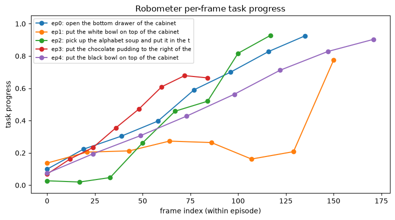

# Reward Scoring for Physical AI

This example uses [daft-physical-ai](https://github.com/Eventual-Inc/daft-physical-ai), a Daft extension for physical AI data pipelines. It scores robot episodes with a reward model ([Robometer-4B](https://huggingface.co/robometer/Robometer-4B)) as a Daft pipeline: per-frame task progress (0-1) plus success probability, written back as a dataset column with `score_rewards`. Downstream uses: filter failed or stalled episodes before BC training, dense reward for RL post-training, and catching mislabeled tasks (all-zero progress usually means the task text is wrong).

Scoring is a pure HTTP call - you bring a running Robometer eval server ([`run_robometer_server.py`](https://github.com/Eventual-Inc/daft-physical-ai/blob/main/examples/rewards/run_robometer_server.py) on any NVIDIA GPU, or `modal deploy` [`modal_eval_server.py`](https://github.com/Eventual-Inc/daft-physical-ai/blob/main/examples/rewards/modal_eval_server.py); both can be found in [the daft-physical-ai repo](https://github.com/Eventual-Inc/daft-physical-ai/tree/main/examples/rewards)) and point `ROBOMETER_URL` at it.

## Setup

Install with `pip install daft-physical-ai matplotlib`, then import.

```python
from daft import col
from daft.datasets import lerobot

from daft_physical_ai.rewards import score_rewards
```

## Configure

The dataset, which camera's video to decode, how many episodes to score, and how many frames to sample per episode.

```python
DATASET = "nvidia/LIBERO_LeRobot_v3"
SPLIT = "libero_90"
VIDEO_KEY = "observation.images.image"  # camera whose video the episodes index into
EPISODES = 5
MAX_FRAMES = 8  # frames sampled per episode (first + last always included)
```

## Point at your Robometer server

The pipeline takes a URL and doesn't care what's behind it - a local GPU ([`run_robometer_server.py`](https://github.com/Eventual-Inc/daft-physical-ai/blob/main/examples/rewards/run_robometer_server.py)), Modal ([`modal_eval_server.py`](https://github.com/Eventual-Inc/daft-physical-ai/blob/main/examples/rewards/modal_eval_server.py)), or anything else that serves the eval server's `/evaluate_batch_npy`.

```python
import os

# Any running Robometer eval server works here - the pipeline only sees a URL.
#   local GPU:  python run_robometer_server.py         (then http://localhost:8001)
#   Modal:      modal deploy modal_eval_server.py      (prints the https URL)
ROBOMETER_URL = os.environ["ROBOMETER_URL"]
# Modal proxy-auth deployments need these two headers; a local server needs none.
HEADERS = (
    {"Modal-Key": os.environ["MODAL_KEY"], "Modal-Secret": os.environ["MODAL_SECRET"]}
    if os.environ.get("MODAL_KEY")
    else None
)
```

## Build the episode DataFrame

One row per episode, straight from Daft's LeRobot reader: `read_episodes` reads the episode metadata and resolves which shared mp4 holds each episode's footage; `include_video_metadata=True` keeps where in that file the episode lives (`from_timestamp`/`to_timestamp`). Everything streams from the Hub - nothing to download first.

```python
df = (
    lerobot.read_episodes(f"hf://datasets/{DATASET}/{SPLIT}", include_video_metadata=True)
    .sort("episode_index")
    .limit(EPISODES)
    .select(
        "episode_index",
        col("tasks").list_join("; ").alias("task"),
        "length",
        col(f"videos/{VIDEO_KEY}/from_timestamp").alias("from_ts"),
        col(f"videos/{VIDEO_KEY}/to_timestamp").alias("to_ts"),
        col(f"videos/{VIDEO_KEY}/video").alias("video"),
    )
)
```

## Score the episodes

`score_rewards` returns a reward column: it samples `MAX_FRAMES` frames per episode, decodes them from the episode's segment of the video (streamed through the file handle), and asks the server for per-frame progress + success. It's a lazy async Daft UDF, so nothing runs until we materialize below - and episodes score concurrently when they do.

```python
df = df.with_column(
    "rewards",
    score_rewards(
        df["task"], df["length"], df["from_ts"], df["to_ts"], df["video"],
        url=ROBOMETER_URL, max_frames=MAX_FRAMES, headers=HEADERS,
    ),
)
```

## Read the curves

A healthy episode climbs toward 1.0. A curve that flatlines near 0 is a failed or stalled episode - or a mislabeled task - that you almost trained on.

```python
episodes = df.to_pylist()
for e in episodes:
    r = e["rewards"]
    print(f"ep{e['episode_index']} ({e['task']}):")
    print(f"  progress = {[round(p, 2) for p in r['reward_score']]}")
    print(f"  success  = {r['robometer_success'][-1]:.2f} (final frame)")
```

```
ep0 (open the bottom drawer of the cabinet):
  progress = [0.1, 0.22, 0.3, 0.4, 0.59, 0.7, 0.83, 0.92]
  success  = 0.97 (final frame)
ep1 (put the white bowl on top of the cabinet):
  progress = [0.14, 0.21, 0.21, 0.27, 0.26, 0.16, 0.21, 0.77]
  success  = 0.49 (final frame)
ep2 (pick up the alphabet soup and put it in the tray):
  progress = [0.03, 0.02, 0.05, 0.26, 0.46, 0.52, 0.82, 0.93]
  success  = 0.93 (final frame)
ep3 (put the chocolate pudding to the right of the plate):
  progress = [0.07, 0.16, 0.23, 0.36, 0.47, 0.61, 0.68, 0.66]
  success  = 0.16 (final frame)
ep4 (put the black bowl on top of the cabinet):
  progress = [0.07, 0.19, 0.31, 0.43, 0.56, 0.71, 0.83, 0.9]
  success  = 0.88 (final frame)
```

## Plot the progress curves

Needs `matplotlib`.

```python
import matplotlib.pyplot as plt

fig, ax = plt.subplots(figsize=(8, 4.5))
for e in episodes:
    r = e["rewards"]
    xs = [f["index"] for f in r["reward_frames"]]
    ax.plot(xs, r["reward_score"], marker="o", label=f"ep{e['episode_index']}: {e['task'][:45]}")
ax.set_xlabel("frame index (within episode)")
ax.set_ylabel("task progress")
ax.set_ylim(-0.05, 1.05)
ax.set_title("Robometer per-frame task progress")
ax.legend(fontsize=8, loc="upper left")
plt.tight_layout()
plt.show()
```



## Filter with a Daft query

The scores are ordinary columns, so quality gates are one-liners - here, episodes whose final-frame success probability is below 0.5.

```python
from daft import col

# episodes the model doubts succeeded - review these before training on them
flagged = df.where(col("rewards")["robometer_success"][-1] < 0.5)
flagged.select("episode_index", "task").show()
```

| episode_index | task |
| --- | --- |
| 1 | put the white bowl on top of the cabinet |
| 3 | put the chocolate pudding to the right of the plate |
