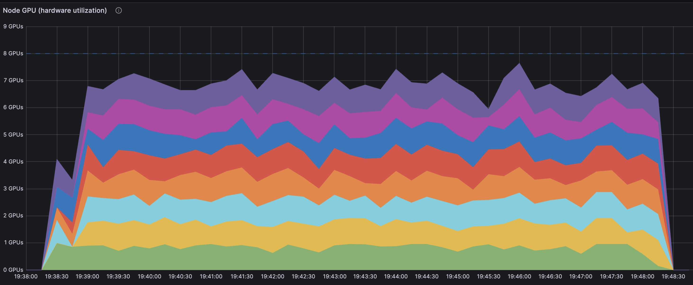

# Generate Text Embeddings for Turbopuffer with Daft

In this example, we demonstrate how to build a text embedding pipeline for processing large text datasets and storing these embeddings in [Turbopuffer](https://turbopuffer.com/). You'll learn how to:

- Process millions of text documents in parallel with distributed computing
- Text chunking best practices for optimal embedding quality
- Generate high-quality embeddings using state-of-the-art models like [Qwen3](https://huggingface.co/Qwen/Qwen3-Embedding-0.6B)
- Perform distributed writes to vector databases like Turbopuffer
- Scale across multiple GPUs with tips for maximizing GPU utilization

> **What is Turbopuffer?** Turbopuffer is a vector database that allows you to store and search through high-dimensional embeddings efficiently. It's designed for production workloads and provides fast similarity search capabilities.

> **What are embeddings?** An [embedding](https://en.wikipedia.org/wiki/Word_embedding) is a representation of data (text, images, audio etc.), often a vector of numerical values, that encodes semantic information. These embeddings can then be used in many applications such as semantic search, deduplication, multi-lingual applications, and so on.

By the end, you should be able to run a text embedding pipeline on a cluster and achieve near 100% GPU utilization for your workloads.




## Pipeline Overview

Our pipeline will:

1. Read text data from Parquet files in S3
2. Split text into sentences using spaCy
3. Generate embeddings using a Qwen3 model
4. Write results to Turbopuffer

## Prerequisites

Before starting, install the required dependencies and download the [spaCy](https://spacy.io/) model for text chunking:

```bash
pip install "daft[ray]" turbopuffer torch sentence-transformers spacy accelerate transformers
python -m spacy download en_core_web_sm
```

[You will also need AWS access](https://docs.aws.amazon.com/cli/latest/userguide/cli-configure-sso.html). Individual methods may vary, but once set up you can login via:

```bash
aws sso login
```

## Step 1: Import Dependencies and Configure Constants

```python
import torch
import daft
from daft import col

NUM_GPU_NODES = 8                     # The number of GPU nodes available
NLP_MODEL_NAME = "en_core_web_sm"     # The spaCy model to use for chunking text
CHUNKING_PARALLELISM = 8              # The number of chunking UDFs to run in parallel per node
EMBEDDING_MODEL_NAME = "Qwen/Qwen3-Embedding-0.6B"  # The text embedding model to use
ENCODING_DIM = 1024                   # The output dimensions for embeddings
BATCH_SIZE = 512                      # The number of records passed into our embeddings UDF
SENTENCE_TRANSFORMER_BATCH_SIZE = 16  # The number of records in each batch to use with SentenceTransformers
```

## Step 2: Create Text Chunking UDF

### Understanding Text Chunking

When creating embeddings, it's useful to split your text into meaningful chunks. Text is hierarchical and can be broken down at different levels: Document → Sections → Paragraphs → Sentences → Words → Characters. The chunking strategy to use depends on your use case.

#### Chunking Strategies

- **Sentence-level chunking** works well for most use cases, especially when the document structure is unclear or inconsistent.
- **Paragraph-level chunking** is good for RAG (Retrieval-Augmented Generation) applications where maintaining context across sentences is important.
- **Section-level chunking** is useful for long documents that have clear structural divisions.
- **Fixed-size chunks** are simple to implement but may break semantic meaning at arbitrary boundaries.

#### When to Use Each Approach

- **Sentence splitting** is the default choice when you're unsure about the document structure or when working with diverse content types.
- **Paragraph splitting** is preferred for RAG systems where maintaining context across multiple sentences matters for retrieval quality.
- **Custom splitting** is necessary for specialized content like tweets, text messages, or code that don't follow standard paragraph structures.

### Implementation

We'll use sentence-level chunking in this example.

We'll also use spaCy, which is a natural language processing library that provides robust sentence boundary detection that handles edge cases better than simple punctuation-based splitting.

```python
# Define the return type for chunked text
# Here we'll keep both the chunked text and the chunk ID which we'll later use for creating IDs for the sentences
chunked_type = daft.DataType.list(
    daft.DataType.struct({
        "text": daft.DataType.string(),
        "chunk_id": daft.DataType.int32()
    })
)

@daft.udf(
    return_dtype=chunked_type,
    concurrency=NUM_GPU_NODES * (CHUNKING_PARALLELISM + 1),
    batch_size=BATCH_SIZE // CHUNKING_PARALLELISM // 2
)
class ChunkingUDF:
    def __init__(self):
        import spacy
        self.nlp = spacy.load(NLP_MODEL_NAME)

    def __call__(self, text_col):
        results = []
        for text in text_col:
            doc = self.nlp(text)
            sentence_texts = [
                {"text": sentence.text, "chunk_id": i}
                for i, sentence in enumerate(doc.sents)
            ]
            results.append(sentence_texts)
        return results
```

This [User-Defined Function (UDF)](../custom-code/udfs.md):

- Loads the spaCy model once per UDF during initialization for efficiency
- Processes batches of text (`text_col`) to minimize overhead
- Returns a list of sentence chunks with unique chunk IDs
- Runs multiple instances in parallel `(NUM_GPU_NODES * CHUNKING_PARALLELISM = 64 total instances)` for distributed processing

## Step 3: Create Embedding Generation UDF

### Choosing a Text Embedding Model

The quality of your embeddings depends heavily on the model you choose. Here are some key considerations:

**Model Performance**

- **MTEB Leaderboard**: Check the [Massive Text Embedding Benchmark (MTEB) leaderboard](https://huggingface.co/spaces/mteb/leaderboard) for the latest performance rankings across various tasks
- **Task-specific performance**: Different models excel at different tasks (semantic search, clustering, classification, etc.)
- **Multilingual support**: Consider if you need to process text in multiple languages

**Some Popular Models**

- **Qwen3-Embedding-0.6B**: Good performance-to-size ratio, state-of-the-art, used in this example
- **all-MiniLM-L6-v2**: The default used in Sentence Transformer's documentation, often used in tutorials
- **gemini-embedding-001**: The current top multilingual model on MTEB. Requires Gemini API access

With open models available on [HuggingFace](https://huggingface.co/), you can easily swap models by changing the `EMBEDDING_MODEL_NAME` constant in the code below.

We'll create a UDF to generate embeddings from the chunked text:

```python
# Define the return type for embeddings
embedding_type = daft.DataType.embedding(daft.DataType.float32(), ENCODING_DIM)

@daft.udf(
    return_dtype=embedding_type,
    concurrency=NUM_GPU_NODES,
    num_gpus=1,
    batch_size=BATCH_SIZE
)
class EncodingUDF:
    def __init__(self):
        from sentence_transformers import SentenceTransformer

        device = 'cuda' if torch.cuda.is_available() else 'cpu'
        self.model = SentenceTransformer(EMBEDDING_MODEL_NAME, device=device)
        self.model.compile()

    def __call__(self, text_col):
        embeddings = self.model.encode(
            text_col.to_pylist(),
            batch_size=SENTENCE_TRANSFORMER_BATCH_SIZE,
            convert_to_tensor=True,
            torch_dtype=torch.bfloat16,
        )
        return embeddings.cpu().numpy()
```

This UDF:

- Loads the SentenceTransformer model on GPU if available
- Uses `bfloat16` precision to reduce memory usage
- Processes text in batches (`SENTENCE_TRANSFORMER_BATCH_SIZE = 128`) for optimal GPU utilization
- Returns numpy arrays which are compatible with Daft

## Step 4: Configure Distributed Processing

You can run this script locally, but if you're interested in running this pipeline on a cluster, check out our guide on [scaling up](../distributed.md). In this example,
we ran on a ray cluster with 8 [g5.2xlarge](https://aws.amazon.com/ec2/instance-types/g5/) workers (each comes with an A10G GPU). To configure our Daft script to use the ray cluster, we added:

```python
# Configure Daft to use Ray to schedule work on different worker nodes
daft.context.set_runner_ray()

# Configure S3 access for reading data
daft.set_planning_config(
    default_io_config=daft.io.IOConfig(
        s3=daft.io.S3Config.from_env()
    )
)
```

## Step 5: Execute the Pipeline

Now we'll execute the complete data processing pipeline:

```python
(
    daft.read_parquet("s3://desmond-demo/text-embedding-dataset.parquet")
    .with_column("sentences", ChunkingUDF(col("text")))
    .explode("sentences")
    .with_column("text", col("sentences")["text"])
    .with_column("chunk_id", col("sentences")["chunk_id"])
    .exclude("sentences")
    .with_column("embedding", EncodingUDF(col("text")))
    .with_column(
        "id",
        col("url").str.right(50) + "-" + col("chunk_id").cast(daft.DataType.string())
    )
    .select("id", "url", "language", "source", "text", "embedding")
    .write_turbopuffer(
        namespace="desmond-scale-experiment6",
        region="aws-us-west-2",
        id_column="id",
        vector_column="embedding",
        distance_metric="cosine_distance"
    )
)
```

**Pipeline steps explained:**

1. **Read data**: Load Parquet files from S3 with large chunk size for efficiency
2. **Chunk text**: Apply sentence splitting UDF
3. **Explode**: Flatten the list of sentences into separate rows
4. **Extract fields**: Get text and chunk_id from the sentence structs
5. **Generate embeddings**: Apply embedding UDF to text
6. **Create IDs**: Generate unique IDs combining URL and chunk_id
7. **Select columns**: Keep only the necessary columns
8. **Write to Turbopuffer**: Store data and vectors in Turbopuffer

If all works out well, when you run this script on your cluster, you should notice that network I/O, CPU work, and GPU work are pipelined to run in parallel, and you should see high GPU utilization :)

## Customization Tips

- **Adjust batch sizes**: Increase `SENTENCE_TRANSFORMER_BATCH_SIZE` for better throughput, decrease for lower GPU memory usage
- **Scale workers**: Modify `NUM_GPU_NODES` and `CHUNKING_PARALLELISM` based on your cluster size and cores available per node
- **Change models**: Replace `EMBEDDING_MODEL_NAME` with other SentenceTransformer models
- **Different chunking**: Modify `ChunkingUDF` to use different text chunking strategies
- **Alternative vector databases**: Replace with other vector databases like Lance, Pinecone, or Chroma

## Performance Considerations

- **GPU memory**: Monitor GPU memory usage and adjust batch sizes accordingly. If your GPUs fail to allocate sufficient memory or you exceed the max sequence length of your embedding model, `SENTENCE_TRANSFORMER_BATCH_SIZE` may be too large
- **Model loading**: UDFs load models once per worker, so initialization time is amortized
- **Quantization**: Use `bfloat16` or `float16` quantization for lower GPU memory utilization and higher throughput.

This pipeline can efficiently process millions of text documents while automatically scaling across your available compute resources.

## Complete Script

Here's the complete script you can run:

```python
import torch
import daft
from daft import col

NUM_GPU_NODES = 8                     # The number of GPU nodes available
NLP_MODEL_NAME = "en_core_web_sm"     # The spaCy model to use for chunking text
CHUNKING_PARALLELISM = 8              # The number of chunking UDFs to run in parallel per node
EMBEDDING_MODEL_NAME = "Qwen/Qwen3-Embedding-0.6B"  # The text embedding model to use
ENCODING_DIM = 1024                   # The output dimensions for embeddings
BATCH_SIZE = 512                      # The number of records passed into our embeddings UDF
SENTENCE_TRANSFORMER_BATCH_SIZE = 16  # The number of records in each batch to use with SentenceTransformers

# Define the return type for chunked text
chunked_type = daft.DataType.list(
    daft.DataType.struct({
        "text": daft.DataType.string(),
        "chunk_id": daft.DataType.int32()
    })
)

@daft.udf(
    return_dtype=chunked_type,
    concurrency=NUM_GPU_NODES * (CHUNKING_PARALLELISM + 1),
    batch_size=BATCH_SIZE // CHUNKING_PARALLELISM // 2
)
class ChunkingUDF:
    def __init__(self):
        import spacy
        self.nlp = spacy.load(NLP_MODEL_NAME)

    def __call__(self, text_col):
        results = []
        for text in text_col:
            doc = self.nlp(text)
            sentence_texts = [
                {"text": sentence.text, "chunk_id": i}
                for i, sentence in enumerate(doc.sents)
            ]
            results.append(sentence_texts)
        return results

# Define the return type for embeddings
embedding_type = daft.DataType.embedding(daft.DataType.float32(), ENCODING_DIM)

@daft.udf(
    return_dtype=embedding_type,
    concurrency=NUM_GPU_NODES,
    num_gpus=1,
    batch_size=BATCH_SIZE
)
class EncodingUDF:
    def __init__(self):
        from sentence_transformers import SentenceTransformer

        device = 'cuda' if torch.cuda.is_available() else 'cpu'
        self.model = SentenceTransformer(EMBEDDING_MODEL_NAME, device=device)
        self.model.compile()

    def __call__(self, text_col):
        embeddings = self.model.encode(
            text_col.to_pylist(),
            batch_size=SENTENCE_TRANSFORMER_BATCH_SIZE,
            convert_to_tensor=True,
            torch_dtype=torch.bfloat16,
        )
        return embeddings.cpu().numpy()

def main():
    # Configure Daft to use Ray to schedule work on different worker nodes
    daft.context.set_runner_ray()

    # Configure S3 access for reading data
    daft.set_planning_config(
        default_io_config=daft.io.IOConfig(
            s3=daft.io.S3Config.from_env()
        )
    )

    (
        daft.read_parquet("s3://desmond-demo/text-embedding-dataset.parquet")
        .with_column("sentences", ChunkingUDF(col("text")))
        .explode("sentences")
        .with_column("text", col("sentences")["text"])
        .with_column("chunk_id", col("sentences")["chunk_id"])
        .exclude("sentences")
        .with_column("embedding", EncodingUDF(col("text")))
        .with_column(
            "id",
            col("url").str.right(50) + "-" + col("chunk_id").cast(daft.DataType.string())
        )
        .select("id", "url", "language", "source", "text", "embedding")
        .write_turbopuffer(
            namespace="desmond-scale-experiment6",
            region="aws-us-west-2",
            id_column="id",
            vector_column="embedding",
            distance_metric="cosine_distance"
        )
    )

if __name__ == '__main__':
    main()
```
