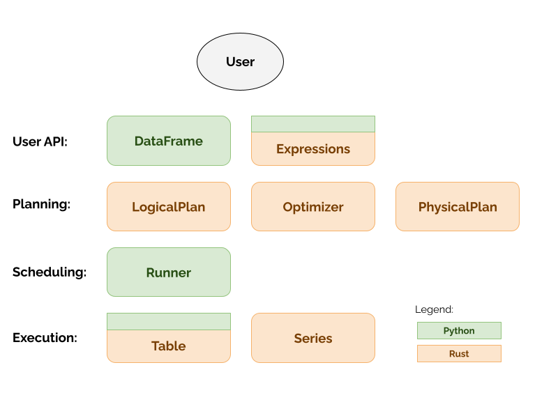

# Architecture

!!! failure "todo(docs): Add information about where Daft fits into the ecosystem or architecture of a system"


## High Level Overview



### 1. User API

!!! info "The user-facing API of Daft"

a. **DataFrame:** A tabular (rows and columns) Python interface to a distributed table of data. It supports common tabular operations such as filters, joins, column projections and (grouped) aggregations.

b. **Expressions:** A tree data-structure expressing the computation that produces a column of data in a DataFrame. Expressions are built in Rust, but expose a Python API for users to access them from Python.

### 2. Planning

!!! info "Users’ function calls on the User API layer are collected into the Planning layer, which is responsible for optimizing the plan and serializing it into a PhysicalPlan for the Scheduling layer."

a. **LogicalPlan:** When a user calls methods on a DataFrame, these operations are enqueued in a LogicalPlan for delayed execution.

b. **Optimizer:** The Optimizer performs optimizations on LogicalPlans such as predicate pushdowns, column pruning, limit pushdowns and more

c. **PhysicalPlan:** The optimized LogicalPlan is then translated into a PhysicalPlan, which can be polled for tasks to be executed along with other metadata such as resource requirements

### 3. Scheduling

!!! info "The scheduling layer is where Daft schedules tasks produced by the PhysicalPlan to be run on the requested backend"

a. **Runner:** The Runner consumes tasks produced by the PhysicalPlan. It is responsible for scheduling work on its backend (e.g. local threads or on Ray) and maintaining global distributed state.

### 4. Execution

!!! info "The Execution layer comprises the data-structures that are the actual in-memory representation of the data, and all of the kernels that run on these data-structures."

a. **Table:** Tables are local data-structures with rows/columns built in Rust. It is a high-performance tabular abstraction for fast local execution of work on each partition of data. Tables expose a Python API that is used in the PhysicalPlans.

b. **Series:** Each column in a Table is a Series. Series expose methods which invoke high-performance kernels for manipulation of a column of data. Series are implemented in Rust and expose a Python API only for testing purposes.

## Execution Model

Daft DataFrames are lazy. When operations are called on the DataFrame, their actual execution is delayed. These operations are “enqueued” for execution in a LogicalPlan, which is a tree datastructure which describes the operations that will need to be performed to produce the requested DataFrame.

=== "🐍 Python"

    ```python
    df = daft.read_csv("s3://foo/*.csv")
    df = df.where(df["baz"] > 0)
    ```

When the Dataframe is executed, a few things will happen:


1. The LogicalPlan is optimized by a query optimizer
2. The optimized LogicalPlan is translated into a PhysicalPlan
3. The Runner executes the PhysicalPlan by pulling tasks from it


These modules can also be understood as:

1. **LogicalPlan:** what to run
2. **PhysicalPlan:** how to run it
3. **Runner:** when and where to run it

By default, Daft runs on the PyRunner which uses Python multithreading as its backend. Daft also includes other runners including the RayRunner which can run the PhysicalPlan on a distributed Ray cluster.

## DataFrame Partitioning

Daft DataFrames are Partitioned - meaning that under the hood they are split row-wise into Partitions of data.

This is useful for a few reasons:

1. **Parallelization:** each partition of data can be processed independently of other partitions, allowing parallelization of work across all available compute resources.
2. **Distributed Computing**: each partition can reside in a different machine, unlocking DataFrames that can span terabytes of data
3. **Pipelining:** different operations may require different resources (some operations can be I/O-bound, while others may be compute-bound). By chunking up the data into Partitions, Daft can effectively pipeline these operations during scheduling to maximize resource utilization.
4. **Memory pressure:** by processing one partition at a time, Daft can limit the amount of memory it needs to execute and possibly spill result partitions to disk if necessary, freeing up memory that it needs for execution.
5. **Optimizations:** by understanding the PartitionSpec (invariants around the data inside each partition), Daft can make intelligent decisions to avoid unnecessary data movement for certain operations that may otherwise require a global shuffle of data.

Partitioning is most often inherited from the data source that Daft is reading from. For example, if read from a directory of files, each file naturally is read as a single partition. If reading from a data catalog service such as Apache Iceberg or Delta Lake, Daft will inherit the partitioning scheme as informed by these services.

When querying a DataFrame, global operations will also require a repartitioning of the data, depending on the operation. For instance, sorting a DataFrame on [`col(x)`](../{{ api_path }}/expression_methods/daft.col.html) will require repartitioning by range on [`col(x)`](../{{ api_path }}/expression_methods/daft.col.html), so that a local sort on each partition will provide a globally sorted DataFrame.

## In-Memory Data Representation


Each Partition of a DataFrame is represented as a Table object, which is in turn composed of Columns which are Series objects.

Under the hood, Table and Series are implemented in Rust on top of the Apache Arrow specification (using the Rust arrow2 library). We expose Python API bindings for Table using PyO3, which allows our PhysicalPlan to define operations that should be run on each Table.

This architecture means that all the computationally expensive operations on Table and Series are performed in Rust, and can be heavily optimized for raw speed. Python is most useful as a user-facing API layer for ease of use and an interactive data science user experience.
