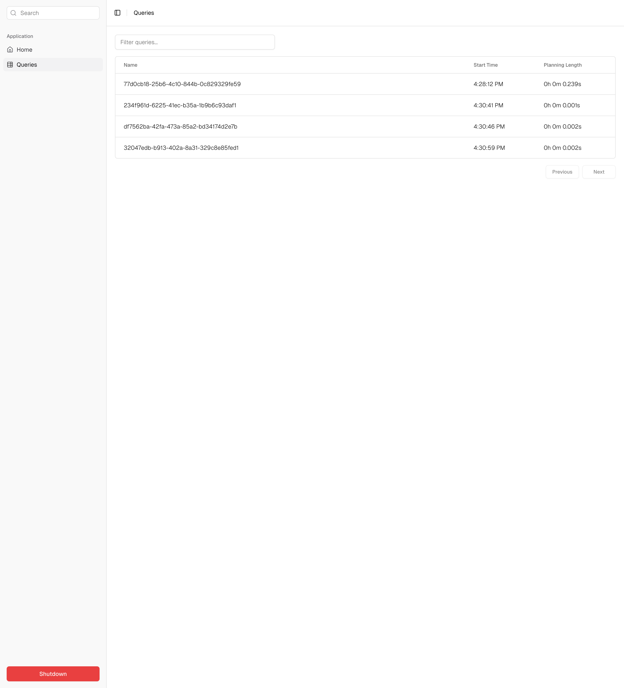
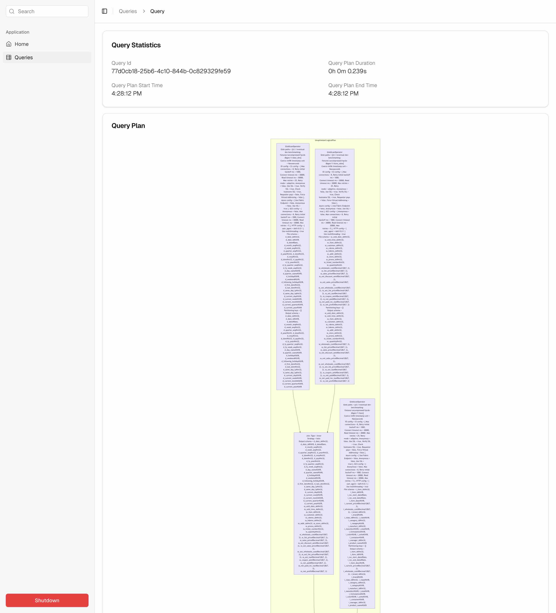

# Dashboard

Daft dashboard is a locally-hosted web-application that allows users to view the query-plan and application level metrics of running a query using Daft.
It enables users to glimpse into the inner-workings of Daft as it's running.




## Installation

In order to install the Daft dashboard, you'll have to install Daft with the dashboarding optional dependency enabled:

```sh
uv pip install "getdaft[dashboard]"
```

Note that if you try to launch the dashboard without enabling this optional dependency, you will get an `ImportError`.
We have intentionally excluded the dashboard HTML/CSS/JS assets from the default Daft install as to not bloat the wheel size.

## Usage

There are two main ways to use the Daft dashboard:

1. Spawn the dashboard process off into an orphaned server process.
2. Start the server in your current process and run your queries in a separate terminal.

Both options are quite simple to get up and running with.

### Spawning into an orphaned process

```py
from daft import dashboard
import daft

# spawn the dashboard
# this is a non-blocking call!
dashboard.launch()

# then run all of your daft queries in the same script!
df = daft.from_pydict({"nums": [1,2,3]})
df.agg(daft.col("nums").stddev()).show()
# etc.
```

### Launching in the current process and submitting queries in another terminal

```py
# terminal 1
from daft import dashboard

# this will launch the dashboard *in the current process*
# this is a blocking call!
dashboard.launch(block=True)
```

Then, in a separate terminal window, run your daft queries, while also ensuring that the `DAFT_DASHBOARD` environment variable is set:

```sh
# terminal 2
DAFT_DASHBOARD=1 python my_daft_script.py
```

In either case, you should see some basic statistics and the query plan being displayed when you click into a query that was run.

### Shutdown

If you launched the dashboard using the second method (i.e., launching it in your current terminal session), you can simply just kill that process by sending a `CTRL-c` interrupt signal to that terminal.

If you launched the dashboard using the first method (i.e., spawning it off into its own orphaned process), then you can kill the orphaned process by pressing the red "Shutdown" button at the bottom lefthand side of the dashboard.

In fact, that red "Shutdown" button can be used via any method to shutdown the dashboard server.

Also, note that when the dashboard process is shutdown, restarting it will *not* bring the previously run query data back.
Daft dashboard does *not* store any query data to disk nor does it store it in the cloud.
Therefore, when the dashboard server process is killed, all of the data that it held is killed as well.

## Security and privacy

An important thing to note here is that Daft dashboard runs purely on localhost.
Namely, it does *not* require any internet connection whatsoever in order to be fully functional.
The dashboard application is served locally through a simple server process that we boot up on request.
Furthermore, all of the data that is displayed will only be locally stored in process memory (not even to local disk).
