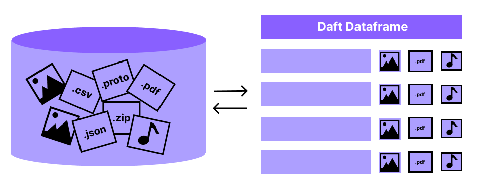

Daft: The Distributed Python Dataframe
======================================

Daft is a **fast and scalable Python dataframe** for Unstructured Data and Machine Learning workloads.

.. NOTE::

   *Daft is currently in its Alpha release phase - please expect bugs and rapid improvements to the project. We welcome user feedback/feature requests in our* `Discussions forums <https://github.com/Eventual-Inc/Daft/discussions>`_.

Install Daft
------------

Daft can be installed from PyPi using pip:

.. raw:: html

   
pip install getdaft

Use-Cases
---------

.. raw:: html

   

      

         <h5>Data Science Experimentation</h5>
         
Daft enables data scientists/engineers to work from their preferred Python notebook environment for interactive experimentation on unstructured data

      

      

         <h5>Unstructured Data Warehousing</h5>
         
The Daft Python dataframe efficiently pipelines unstructured data from raw data lakes to clean, queryable datasets for analysis and reporting.

      

      

         <h5>Machine Learning Training Dataset Curation</h5>
         
Modern Machine Learning is data-driven and relies on clean data. The Daft Python dataframe integrates with dataloading frameworks such as <a href="https://www.ray.io">Ray</a> and <a href="https://www.pytorch.org">PyTorch</a> to feed data to distributed model training.

      

      

         <h5>Machine Learning Model Evaluation</h5>
         
Evaluating the performance of machine learning systems is challenging, but Daft Python dataframes make it easy to run models and SQL-style analyses at scale.

      

   

Key Features
------------

.. raw:: html

   

      

         <h5>Python UDF</h5>
         
Daft supports running User-Defined Functions (UDF) on columns of Python objects - if Python supports it Daft can handle it!

      

      

         <h5>Interactive Computing</h5>
         
Daft embraces Python's dynamic and interactive nature, enabling fast, iterative experimentation on data in your notebook and on your laptop.

      

      

         <h5>Distributed Computing</h5>
         
Daft integrates with frameworks such as <a href="https://www.ray.io">Ray</a> to run large petabyte-scale dataframes on a cluster of machines in the cloud.

      

   

Integrations
------------

Daft is open-sourced and you can use any Python library when processing data in a dataframe. It integrates with many other open-sourced technologies as well, plugging directly into your current infrastructure and systems.

.. raw:: html

   

      

         <h5>Data Science and Machine Learning</h5>
         

            
            
            
            
            
         

      

      

         <h5>Storage</h5>
         

            
            
            
            
            
         

      

   

Community
---------

.. raw:: html

   

      

         <a href="https://github.com/Eventual-Inc/Daft/discussions" style="display: block; height: 100%;">
            

                  
                  <h5>Github Discussions Forums</h5>
                  
Post questions, suggest features and more

            

         </a>
      

      

         <a href="https://discord.gg/eByWAQwTaP" style="display: block; height: 100%;">
            

               
               <h5>Discord Server</h5>
               
Chat with Daft maintainers and show off your projects!

            

         </a>
      

   

Get Started
-----------

.. raw:: html

    
<iframe src="https://www.loom.com/embed/12b02103a23b47558a7655d410efa46b" frameborder="0" webkitallowfullscreen mozallowfullscreen allowfullscreen style="position: absolute; top: 0; left: 0; width: 100%; height: 100%;"></iframe>

----

.. raw:: html

   

      

         <h5>10-minute to Daft</h5>
         
10-minute walkthrough of all of Daft's major functionality.

         <a href="/docs/learn/10-min.html">View Walkthrough</a>
      

      

         <h5>Tutorials</h5>
         
Hosted examples using Daft in various common use-cases.

         <a href="/docs/learn/tutorials.html">View Tutorials</a>
      

      

         <h5>Docs</h5>
         
Developer documentation for referencing Daft APIs.

         <a href="/docs/index.html">View Docs</a>
      

   

.. toctree::
   :hidden:

   docs/index
   dataframe_comparison

.. .. Indices and tables
.. .. ==================

.. .. * :ref:`genindex`
.. .. * :ref:`modindex`
.. .. * :ref:`search`
