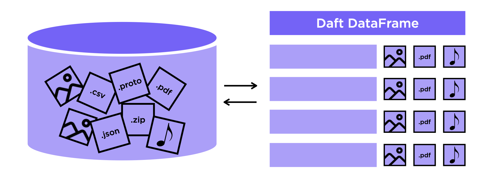

# Terminology

Daft is a distributed data engine. The main abstraction in Daft is the [`DataFrame`](api/dataframe.md), which conceptually can be thought of as a "table" of data with rows and columns.

Daft also exposes a [`SQL`](core_concepts.md#sql) interface which interoperates closely with the DataFrame interface, allowing you to express data transformations and queries on your tables as SQL strings.



## DataFrames

The [`DataFrame`][daft.DataFrame] is the core concept in Daft. Think of it as a table with rows and columns, similar to a spreadsheet or a database table. It's designed to handle large amounts of data efficiently.

Daft DataFrames are lazy. This means that calling most methods on a DataFrame will not execute that operation immediately - instead, DataFrames expose explicit methods such as [`daft.DataFrame.show()`][daft.DataFrame.show] and [`daft.DataFrame.write_parquet()`][daft.DataFrame.write_parquet] which will actually trigger computation of the DataFrame.

> Learn more at [DataFrame](core_concepts.md#dataframe)

## Expressions

An [`Expression`](api/expressions.md) is a fundamental concept in Daft that allows you to define computations on DataFrame columns. They are the building blocks for transforming and manipulating data within your DataFrame and will be your best friend if you are working with Daft primarily using the Python API.

> Learn more at [Expressions](core_concepts.md#expressions)

## Query Plan

As mentioned earlier, Daft DataFrames are lazy. Under the hood, each DataFrame in Daft is represented by `LogicalPlan`, a plan of operations that describes how to compute that DataFrame. This plan is called the "query plan" and calling methods on the DataFrame actually adds steps to the query plan! When your DataFrame is executed, Daft will read this plan, optimize it to make it run faster and then execute it to compute the requested results.

You can examine a logical plan using [`df.explain()`][daft.DataFrame.explain], here's an example:

=== "🐍 Python"

    ```python
    df2 = daft.read_parquet("s3://daft-public-data/tutorials/10-min/sample-data-dog-owners-partitioned.pq/**")
    df2.where(df["country"] == "Canada").explain(show_all=True)
    ```

```{title="Output"}
== Unoptimized Logical Plan ==

* Filter: col(country) == lit("Canada")
|
* GlobScanOperator
|   Glob paths = [s3://daft-public-data/tutorials/10-min/sample-data-dog-owners-
|     partitioned.pq/**]
|   Coerce int96 timestamp unit = Nanoseconds
|   IO config = S3 config = { Max connections = 8, Retry initial backoff ms = 1000,
|     Connect timeout ms = 30000, Read timeout ms = 30000, Max retries = 25, Retry
|     mode = adaptive, Anonymous = false, Use SSL = true, Verify SSL = true, Check
|     hostname SSL = true, Requester pays = false, Force Virtual Addressing = false },
|     Azure config = { Anonymous = false, Use SSL = true }, GCS config = { Anonymous =
|     false }, HTTP config = { user_agent = daft/0.0.1 }
|   Use multithreading = true
|   File schema = first_name#Utf8, last_name#Utf8, age#Int64, DoB#Date,
|     country#Utf8, has_dog#Boolean
|   Partitioning keys = []
|   Output schema = first_name#Utf8, last_name#Utf8, age#Int64, DoB#Date,
|     country#Utf8, has_dog#Boolean


== Optimized Logical Plan ==

* GlobScanOperator
|   Glob paths = [s3://daft-public-data/tutorials/10-min/sample-data-dog-owners-
|     partitioned.pq/**]
|   Coerce int96 timestamp unit = Nanoseconds
|   IO config = S3 config = { Max connections = 8, Retry initial backoff ms = 1000,
|     Connect timeout ms = 30000, Read timeout ms = 30000, Max retries = 25, Retry
|     mode = adaptive, Anonymous = false, Use SSL = true, Verify SSL = true, Check
|     hostname SSL = true, Requester pays = false, Force Virtual Addressing = false },
|     Azure config = { Anonymous = false, Use SSL = true }, GCS config = { Anonymous =
|     false }, HTTP config = { user_agent = daft/0.0.1 }
|   Use multithreading = true
|   File schema = first_name#Utf8, last_name#Utf8, age#Int64, DoB#Date,
|     country#Utf8, has_dog#Boolean
|   Partitioning keys = []
|   Filter pushdown = col(country) == lit("Canada")
|   Output schema = first_name#Utf8, last_name#Utf8, age#Int64, DoB#Date,
|     country#Utf8, has_dog#Boolean


== Physical Plan ==

* TabularScan:
|   Num Scan Tasks = 1
|   Estimated Scan Bytes = 6336
|   Clustering spec = { Num partitions = 1 }
```

Because we are filtering our DataFrame on the partition column country, Daft can optimize the `LogicalPlan` and save time and computing resources by only reading a single partition from disk.


## SQL

[SQL (Structured Query Language)](https://en.wikipedia.org/wiki/SQL) is a common query language for expressing queries over tables of data. Daft exposes a SQL API as an alternative (but often also complementary API) to the Python [`DataFrame`](api/dataframe.md) and [`Expression`](api/expressions.md) APIs for building queries.

You can use SQL in Daft via the [`daft.sql()`][daft.sql.sql.sql] function, and Daft will also convert many SQL-compatible strings into Expressions via [`daft.sql_expr()`][daft.sql.sql.sql_expr] for easy interoperability with DataFrames.

> Learn more at [SQL](core_concepts.md#sql)
