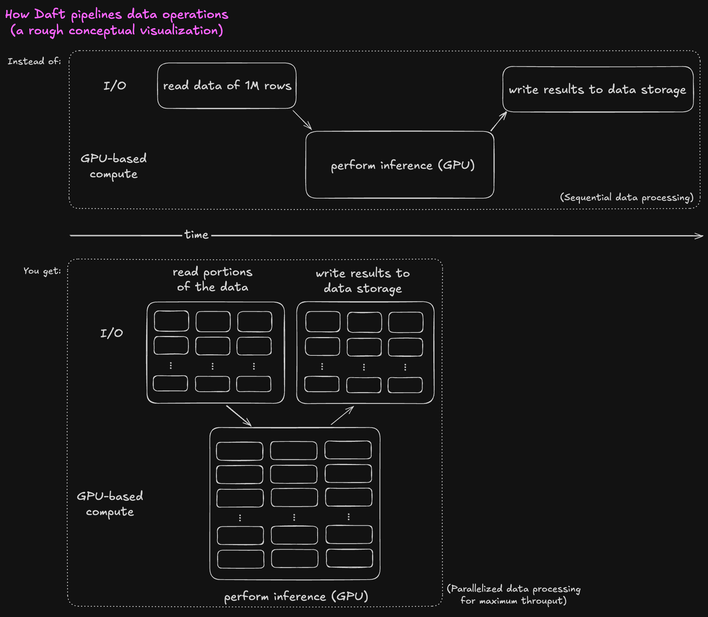

# Batch Inference

Run prompts, embeddings, and model scoring over large datasets, then stream the results to durable storage. Daft is a reliable engine to express batch inference pipelines and scale them from your laptop to a distributed cluster.

## When to use Daft for batch inference

- **You need to run models over your data:** Express inference on a column (e.g., [`llm_generate`](#example-text-generation-with-openai), [`embed_text`](../modalities/text.md#how-to-use-the-embed_text-function), [`embed_image`](../modalities/images.md#generate-image-embeddings)) and let Daft handle batching, concurrency, and backpressure.
- **You have data that are large objects in cloud storage:** Daft has [record-setting](https://www.daft.ai/blog/announcing-daft-02) performance when reading from and writing to S3, and provides flexible APIs for working with [URLs and Files](../modalities/urls.md).
- **You're working with multimodal data:** Daft supports datatypes like [images](../modalities/images.md) and [videos](../modalities/videos.md), and supports the ability to define [custom data sources and sinks](../connectors/custom.md) and [custom functions over this data](../custom-code/udfs.md).
- **You want end-to-end pipelines where data sizes expand and shrink:** For example, downloading images from URLs, decoding them, then embedding them; [Daft streams across stages to keep memory well-behaved](https://www.daft.ai/blog/processing-300k-images-without-oom).

If you’re new to Daft, see the [quickstart](../quickstart.md) first. For distributed execution, see our docs on [Scaling Out and Deployment](../distributed/index.md).

## Core idea

Daft provides first-class APIs for model inference. Under the hood, Daft pipelines data operations so that reading, inference, and writing overlap automatically, and is optimized for throughput.



## Example: Text generation with OpenAI

=== "🐍 Python"
```python
import daft
from daft.functions import llm_generate

(
    daft.read_huggingface("fka/awesome-chatgpt-prompts")
    .with_column( # Generate model outputs in a new column
        "output",
        llm_generate(
            daft.col("prompt"),
            model="gpt-4o",           # Any chat/completions-capable model
            provider="openai",        # Switch providers by changing this; e.g. to "vllm"
            api_key="...",            # Pass via environment variable or secret manager
            temperature=0.2,
            max_tokens=256,
        ),
    )
    .write_parquet("output.parquet/", write_mode="overwrite")  # Write to Parquet as the pipeline runs
)
```

What this does:

- Uses [`llm_generate()`][daft.functions.llm_generate] to express inference.
- Streams rows through OpenAI concurrently while reading from Hugging Face and writing to Parquet.
- Requires no explicit async, batching, rate limiting, or retry code in your script.

## Example: Local text embedding with LM Studio

=== "🐍 Python"
```python
import daft
from daft.ai.provider import load_provider
from daft.functions.ai import embed_text

provider = load_provider("lm_studio")
model = "text-embedding-nomic-embed-text-v1.5"

(
    daft.read_huggingface("Open-Orca/OpenOrca")
    .with_column("embedding", embed_text(daft.col("response"), provider=provider, model=model))
    .show()
)
```

Notes:

- [LM Studio](https://lmstudio.ai/) is a local AI model platform that lets you run Large Language Models like Qwen, Mistral, Gemma, or gpt-oss on your own machine. By using Daft with LM Studio, you can perform inference with any model locally, and utilize accelerators like [Apple's Metal Performance Shaders (MPS)](https://developer.apple.com/documentation/metalperformanceshaders).

## Scaling out on Ray

Turn on distributed execution with a single line; then run the same script on a Ray cluster.

```python
import daft
daft.context.set_runner_ray()  # Enable Daft's distributed runner
```

Daft partitions the data, schedules remote execution, and orchestrates your workload across the cluster-no pipeline rewrites.

## Patterns that work well

- **Read → Preprocess → Infer → Write**: Daft parallelizes and pipelines automatically to maximize throughput and resource utilization.
- **Provider-agnostic pipelines**: Switch between OpenAI and local LLMs by changing a single parameter.

## Case Studies

For inspiration and real-world scale:

- [Processing 24 trillion tokens with 0 crashes—How Essential AI built Essential-Web v1.0 with Daft](https://www.daft.ai/blog/how-essential-ai-built-essential-web-v1-with-daft)
- [Processing 300K Images Without OOMs](https://www.daft.ai/blog/processing-300k-images-without-oom)
- [Embedding millions of text documents with Qwen3, achieving near 100% GPU utilization](https://www.daft.ai/blog/embedding-millions-of-text-documents-with-qwen3)

## Next Steps

Ready to explore Daft further? Check out these topics:

- [AI functions](../api/ai.md)
- Reading from and writing to common data sources:
    - [S3](../connectors/aws.md)
    - [Hugging Face 🤗](../connectors/huggingface.md)
    - [Turbopuffer](../connectors/turbopuffer.md)
- [Scaling out and deployment](../distributed/index.md)
