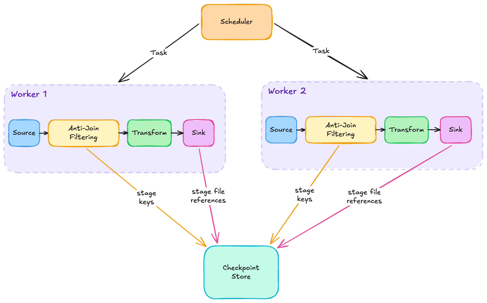

# Checkpointing

Daft pipelines that do expensive per-row work — LLM calls, embeddings, model inference, FFMPEG transforms, third-party API calls — can run for hours and incur significant cost. When they fail partway through, or get rerun for non-crash reasons (a bad UDF, bad config, bad input data), a restart from scratch is wasteful. Checkpointing tracks which inputs have been processed and skips them on rerun.

## Checkpointing Guarantees

Checkpointing offers two guarantees. The first holds wherever the feature is enabled: on a rerun, the source filters out inputs that were processed in a previous run. Expensive work doesn't get repeated.

The second is stronger but requires the sink to cooperate. For transactional table formats like Iceberg and Delta, Daft offers idempotent commits — the destination ends up in the same state whether the job ran once or fifteen times. No duplicate snapshots, no double-committed rows. The connector pages cover which sinks support this and the per-sink details.

## Under the Hood

A run is distributed across workers by a scheduler — the diagram shows two workers, but there can be more. Each worker runs the same pipeline shape: data flows from the Source through an Anti-Join Filtering step, then through the user's Transform operations, and finally into the Sink. The Checkpoint Store sits alongside, collecting records as the pipeline runs.

- **Anti-Join Filtering** — the skip mechanism. Consults the Checkpoint Store and drops source rows whose keys are already recorded there. New rows pass through, and their keys get staged into the store.
- **Sink** — writes the actual data files to the destination (S3 or the table's warehouse path). The bytes themselves don't go through the Checkpoint Store; only file references do.
- **Checkpoint Store** — at task completion, atomically records two things: which inputs were processed (keys, picked up at the anti-join) and which files were produced (file references, picked up at the sink). Records persist between runs, so the next run sees them.

## Scope of the Guarantees

**Exactly-once is about the commit, not the pipeline.** The guarantee applies to the committed output, not to every operation that ran on the way there. If a UDF in the middle of a pipeline calls an external API and the run crashes before commit, the next run will call it again — Daft can't unwind an HTTP request that's already gone out. Cost models that assume the pipeline is exactly-once will be wrong.

**The skip is transform-agnostic.** What the pipeline does with a row doesn't affect whether the source filter skips it on rerun. Once a source row is marked processed, it's processed — whether the pipeline filtered it out, exploded it into 1000 pages, or dropped it entirely. This comes from keying off the source row's identity, not what shows up at the sink.

## Limitations

- **Map-only pipelines.** Operators between source and sink must be row-in → row-out (filter, projection, UDFs, `explode`, `unpivot`, `into_batches`). Rejected at plan build time:
    - **Shuffles:** `sort`, `top_k`, `repartition`, `distinct`, `groupby` / aggregation, `pivot`, window functions, `join`, `asof_join`.
    - **Multi-source:** `concat`, `union_all`, `intersect`.
    - **Row-selectors:** `limit`, `offset`, `sample`.

- **Source needs an `on=` key column.** A column that uniquely identifies a source input. Must exist in the source schema.

- **Ray runner only.** Checkpointing is gated to Flotilla (the Ray-backed runner). The native runner raises if you try to use it.

- **Single-writer concurrency.** At most one Python process per logical commit. The retry loop is defensive against transient catalog errors, not against two processes racing the same commit.

- **Orphan files on crash.** A worker that crashes mid-task may leave data files at the warehouse path that the checkpoint store doesn't track. Minor — completed tasks' files are tracked and recovered. Daft doesn't auto-clean orphans; use engine-specific vacuum tooling.

- **Filters and projections can't push past the source.** Every row must be read and the key column has to be retained until the anti-join, even if a downstream filter would drop most of them. Scan-time cost paid in exchange for the "filtered-out keys still get checkpointed" guarantee.

## Recovery

Each crash point in a run has a different recovery story. The cases below run chronologically through one execution.

**Crash during pipeline execution (completed tasks).** Workers that completed their tasks have their keys + file references atomically visible in the store. On rerun, the source filter sees those keys and skips them — no redo of expensive work.

**Crash mid-task (keys staged, files not yet).** A task stages keys early (after the source filter) and file references late (after the sink writes files); the transform runs in between. A crash in this window leaves the task's staged work invisible — staging only becomes visible to the store at task completion. The whole task redoes on rerun, including the transform. This is the chronological view of what [Scope of the Guarantees](#scope-of-the-guarantees) calls "exactly-once is about the commit, not the pipeline." Any partial data files written by the crashed task become orphans (see [Limitations](#limitations)).

**Crash between pipeline completion and catalog commit.** All workers finished and staged; the driver hadn't committed yet. On rerun, the source filter sees all keys, so the pipeline executes as a no-op. The driver then commits the staged file references to the catalog.

**Crash between catalog commit and bookkeeping, or any re-run after success.** The catalog has the commit tagged with `daft.idempotence-key`. On rerun, Daft walks the catalog, finds the marker, marks the store as committed, and exits without committing again. This is also why a deliberate re-run with the same idempotence key is a no-op.

## See Also

- **Idempotent Iceberg writes** — [Checkpointing section in the Iceberg connector page](../connectors/iceberg.md#checkpointing).
- **Idempotent Delta Lake writes** — [Checkpointing section in the Delta Lake connector page](../connectors/delta_lake.md#checkpointing).
- **API reference** — `daft.CheckpointStore`, `daft.CheckpointConfig`, `daft.IdempotentCommit`.

<!-- TODO: add link to AI-functions guide CheckpointTerminusNode example once written. -->
<!-- TODO: once DF-2081 lands and these classes are on an API reference page, switch to autoref links: [`daft.CheckpointStore`][daft.CheckpointStore] etc. -->
