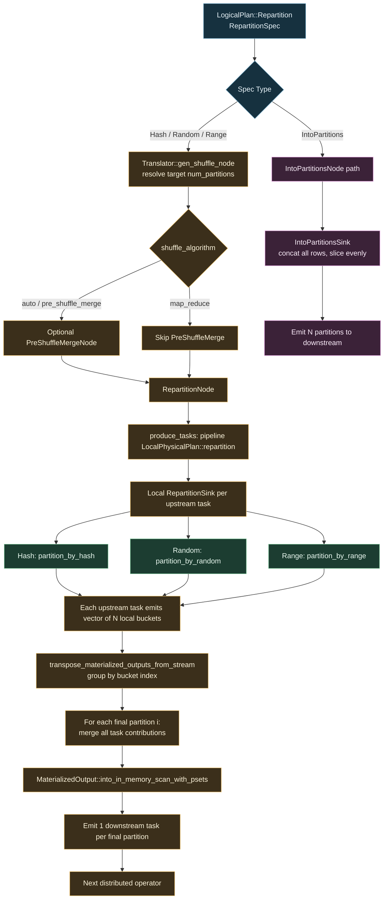

# Flotilla Distributed Repartition Flow

## Notes

- For `Hash` / `Random` / `Range`, Flotilla executes a distributed shuffle with transpose+merge.
- The transpose step is why output has exactly `N` downstream tasks: one task per final partition index.
- `IntoPartitions` does **not** go through `RepartitionSink` in this distributed path; it has its own node/sink.
